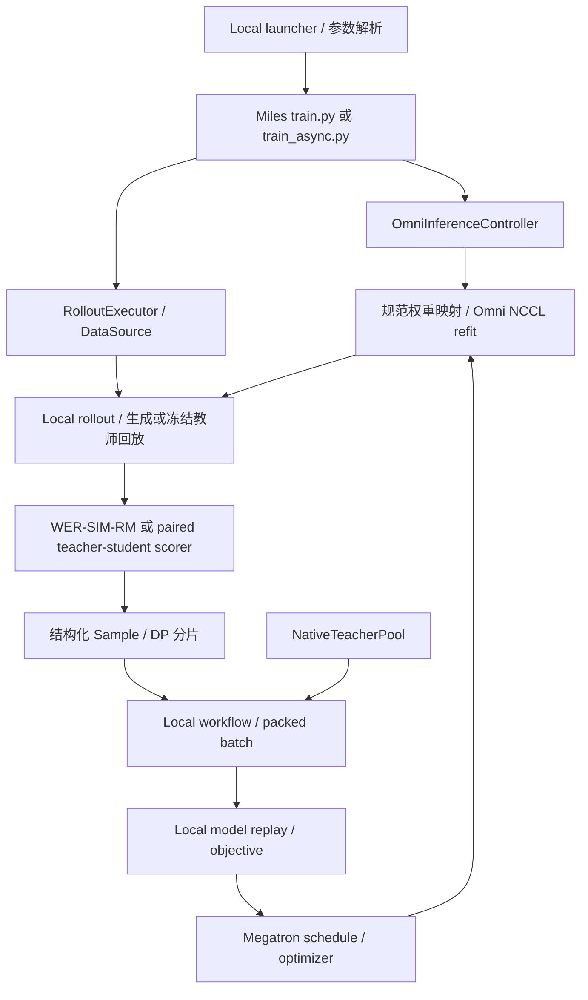

# MOSS-TTS Local RL：提交演进与重构分析

分析日期：2026-09-14。代码范围：本地 `moss-tts-dev-base`（`3de96596f16b9e6d23ba550c4c47de3479c9f14c`）到 `moss-tts-local` 的 `9507d4a99632850e29b6ff6221b2ed83a0778016`，共 15 个提交。该基点是本地两个分支的共同祖先；没有将其他上游提交混入分析，也没有查询远端最新状态。

**总体判断：当前实现已经积累了相当扎实的 Local 数学和实验验证，但框架扩展接口、长期资源状态、目标函数与实验诊断之间尚未完全分离。最有价值的重构是收拢这些契约，降低修改一个目标或运行模式时必须同时理解的模块数量。单纯按文件行数拆分的收益有限。**

本次只增加分析文档，没有修改训练代码、安装依赖、启动 GPU 实验、提交或推送。下文区分源码事实、最小复现、已有文档报告的实验结果，以及需要后续验证的设计建议。

**1. 提交范围与演进脉络**

整个分支差异为 101 个文件，20,192 行新增、35 行删除。其中运行代码 66 个文件，新增 7,921 行、删除 35 行；测试及快照 23 个文件，新增 3,106 行；文档 12 个文件，新增 9,165 行。`miles/policies/moss_tts_local/` 自身为 32 个 Python 文件、5,975 行。最新提交的 9,439 行新增中，8,161 行来自文档，不能把它误解为一次近万行训练算法改动。

| 提交 | 实际作用 | 对重构的意义 |
| --- | --- | --- |
| `e9adc2e2c` | 引入 Local 模型、结构化轨迹、frame-joint GRPO、原生 checkpoint 加载、Omni 外部服务与 refit、奖励和评估脚本；67 个文件 | 架构基础，也带来了大部分通用代码中的 Local 分支。应按模型、数据、训练接入、服务接入分别识别职责，不宜整体重写 |
| `3ad3e6189` | 记录 paired WER 评估需要显式设置的 Omni 参数 | 表明运行参数属于可复现契约，需要由 recipe 和运行清单承接 |
| `223de6d59` | 将文档参数对齐成功的长跑命令 | 实验成功配置与脚本默认值需要明确区分，不能根据较晚文档擅自修改默认 recipe |
| `fbb0b8746` | 说明 streaming vocoder graph 不加速当前 RL generate | 保留这一性能范围说明，防止把 streaming 的优化当作非流式 RL 的优化 |
| `f7ba9e97f` | 增加领域路由、teacher/student paired prefill、逐 action MOPD，以及 student scorer 的权重发布 | 目标函数依赖不再只是标量 reward；首次需要区分生成分数与 supplied-action 分数 |
| `c97f0a795` | 验证 TE 的加载行为，区分 runtime extra state 与真实张量，并限制不安全的优化器跨后端恢复 | 是正确性保护；checkpoint 重构必须保留，不能用放宽 strictness 代替映射 |
| `d4c634b5e` | 记录 full TE fusions 的真实 WER 训练与继续训练 | 提供迁移验收参考，不等于所有 Local/TE 组合都已验证 |
| `c49733485` | 引入一批预取的 bounded async、版本匹配的 trainer behavior snapshot，以及训练/生成计时 | 状态开始跨 rollout 存活；需要明确 snapshot 与版本的生命周期所有者 |
| `33f7c61e2` | 记录真实 async/sync 对比、checkpoint continuation | 验证的是限定配置的重叠收益，不应在重构中扩展为任意 stale rollout 或 fully async |
| `edf41788e` | 增加可配置 WER/SIM/RM 组合、RM 客户端、launcher 参数 | reward 从单一标量函数扩展为并发外部评分；旧 SIM/WER 实现仍保留，出现两套组合契约 |
| `487a2eda9` | 兼容 group RM，并在 RM 完成时合并最新 metadata | 修正了入口形状与并发写 metadata 的问题，说明评分结果应显式返回再统一合并 |
| `f345a5db0` | 把所有活跃 reward component 放到同一次 gather 中启动 | 有实际调度语义变化：原先 SIM coroutine 延迟 await，WER/RM 的 gather 已经启动；不能归类为仅格式整理 |
| `d5d92530c` | 将配置解析、RewardComponent 和 bounding 移到独立文件 | 方向合理；但参数入口仍经由 reward_composite 导入 parse_components，依赖隔离没有彻底完成 |
| `f20b15788` | 记录重构后的 MOPD 验证 | 其中也涉及 Omni 仓库 scoring 拆分；应区分跨仓库实验结果与 Miles 当前实现 |
| `9507d4a99` | 增加 sampled_native、dense KL、prefix/codebook/decision weighting、领域目标、冻结教师轨迹回放及大量实验文档 | 当前最需要收敛的增量：workflow 继续增加目标分支，远端诊断与 native 优化链路叠加，版本字段开始承担多种语义 |

对 `d5d92530c`，本次用 AST 比较确认 `RewardComponent`、`parse_components`、`_bounded -> bound_reward` 的可执行 body 保持一致；不过符号更名、新 docstring 和格式差异存在。按本仓库 mechanical-refactor-verify 的 clean-move 定义，它不能直接称为已认证的纯搬移。本次没有生成字节级 reproduce 证明，也不把 AST 等价当作整提交语义证明。

**2. 当前真实执行路径**



框架已经复用了 Miles 的 rollout executor、DP 调度、对象存储、Megatron forward/backward schedule、optimizer 和主训练循环，这些是应该保留的基础。Local 真正特殊的部分是音频动作几何、模型 replay、目标归约及其 provenance。

Local 的轨迹不是一串可以直接交给文本 PPO 的 token：

- prompt 为 `[P, 13]`，其中一列 text、十二列 audio；code 为 `[T, 12]`。
- 每帧有 continue/stop 决策，continue 后再产生 12 个按深度自回归的 code。
- 自然结束 `R=T+1`，最后有 stop；长度截断 `R=T`，不得伪造 stop。
- 全局 decoder 使用 `P+T` 行，预测位置从 prompt 最后一行开始。Packed THD 必须隔离样本 attention 和 position。
- audio embeddings 与 audio heads 是独立参数；`audio_pad_code=1024` 不属于 1024 项的采样词表，不能因为整理模型而增加或绑定一行参数。

关键源码为 [types.py](../../miles/policies/moss_tts_local/types.py)、[trace_codec.py](../../miles/policies/moss_tts_local/trace_codec.py)、[batch.py](../../miles/policies/moss_tts_local/batch.py)、[model.py](../../miles/policies/moss_tts_local/model.py)、[policy.py](../../miles/policies/moss_tts_local/policy.py)。这些已经形成有价值的 Module，不应在通用化过程中丢掉它们的明确语义。

**3. 必须先固定的目标函数契约**

| 路径 | 优化单位 | 分数来源和归约 | 重构时必须保留的区别 |
| --- | --- | --- | --- |
| WER/SIM/RM GRPO | 每个 decision event 的 frame-joint ratio | continue 的 joint logprob 是 decision 与所有有效 code logprob 之和；stop 只有 decision；样本内平均后样本等权 | 不能将 12 个 code 当作 12 个文本 token 再改变样本/帧权重 |
| sampled MOPD | decision/code 各自的 selected action | teacher 与 student 在相同 supplied-action prefill context 上评分；按每个样本有效 action 数归约 | paired prefill 不是可随意删除的冗余调用，它避免把执行路径差异当作学习信号 |
| sampled_native | native 同实现的 selected action | 现有实现先取得 native logits，再抽取 teacher selected score；student 使用 native replay | 与 sampled 目标相近，但 teacher 执行路径、数值差异不同 |
| dense_reverse / dense_forward | 已访问状态上各个 action 的完整 categorical distribution | 分别计算 KL(student‖teacher)、KL(teacher‖student)，teacher detach，样本等权 | 这是访问状态上的完整词表 KL；没有枚举所有未来轨迹，也不等于完整序列分布 KL |
| mixed teacher replay | 学生轨迹与冻结教师轨迹混合 | 当前只允许同步 native dense 路径；保持教师真实行为版本，另存当前 student scoring version | 是混合 GKD，不能重新命名为纯 on-policy MOPD |

frame-joint 记为 `log π(event) = log π(decision) + Σ log π(code_q)`，terminal 不包含 code 项。需要保留 [loss.py](../../miles/policies/moss_tts_local/loss.py)、[mopd_loss.py](../../miles/policies/moss_tts_local/mopd_loss.py)、[dense_mopd.py](../../miles/policies/moss_tts_local/dense_mopd.py) 当前不同的数学单位，而不只是给它们统一一个函数名。

`trainer_preupdate` 也需要进一步写清楚。默认同步 WER 使用 same-forward：`old = current.detach()`，ratio 数值为 1，梯度仍非零，但 clipping 在这一 forward 上不激活。关闭复用后，WER 可先 replay 再使用旧分母；MOPD 的 `trainer_preupdate` 则仍在 action loss 内使用当前输出的 detach。不同路径不是完全相同的 old-policy 定义。

`trainer_behavior` 使用与生成发布版本匹配的 trainer 参数快照，解决训练端策略版本错配；它仍不证明 trainer 与 serving 的 forward 数值完全相等。文档已记录 native/serving 的 selected-code 差异，不能在重构时把这一 surrogate 更名为严格 serving on-policy correction。

`server_behavior` 使用服务端分母并检查 parity。是否需要 old-policy、是否需要 paired scoring、是否需要 full logits，应成为 objective 的显式需求，不能让 dense KL 也为了满足 workflow 入口而携带未参与其 loss 的 advantages 和 PPO baseline。

**4. 优先级最高：奖励数据契约已经出现可复现问题**

**4.1 新 SIM composite 与旧 metrics 字段不一致。** [reward_composite.py](../../miles/policies/moss_tts_local/reward_composite.py) 写入 `sim_reward` 和 `reward`，但 [rollout.py](../../miles/policies/moss_tts_local/rollout.py) 的 `_wer_rollout_metrics` 在发现 `sim_reward` 后读取 `mixed_reward`。最小复现使用 fake SIM scorer，得到 reward `[0.8]`，随后 metrics 抛出 `KeyError: 'mixed_reward'`。真实触发条件是新 composite 启用正权重 SIM、且样本没有旧入口遗留的 `mixed_reward` 字段。

这说明测试要跨越一次真实调用链：`component score -> composite -> sample -> rollout metrics`。现有 composite 测试覆盖 WER 和 WER+RM，没有覆盖新 SIM composite 与 rollout 汇总的组合。

**4.2 等价配置文本可能选择不同的 WER 语义。** launcher 在 `reward_components.strip() == "wer=1.0"` 时选择原始 WER，否则进入 composite。原始 `WordErrorRateScore.reward = 1-WER` 可为负；composite 经 `bound_reward` 截到 `[0,1]`。所以 `wer=1.0` 和数值等价的 `wer=1` 可能选择不同目标。合成 WER=1.5 的检查得到旧 reward=-0.5、composite=0。

组合奖励有界可以是合理设计，但它必须是明确配置，不能依赖字符串格式。第一次修复应保持旧默认语义，把 unbounded WER 与 bounded WER 明确命名；不要在“统一入口”的提交里悄悄改变既有实验目标。

**4.3 建议的 Module。** 保留外部 `reward_func(args, sample|list)` 兼容入口，内部使用一个 `RewardPipeline.score(samples)`。ASR、SIM、RM 返回结果和 diagnostics，不直接修改同一 `Sample.metadata`；pipeline 在所有结果通过校验后统一合并。这样同一条样本的字段归属与失败处理集中在一个地方。

优先拆出已有真实差异：ASR transcript/error scoring、SIM reference/candidate scoring、RM rubric scoring，以及纯标量 composition。保留旧 `sim_wer_reward.reward_func` 等字符串入口作为兼容 wrapper，让它们使用同一个组合实现，并显式保持旧字段与奖励范围。

不需要为了三个 scorer 建复杂注册系统；先用小表或函数组合即可。稳定配置在 pipeline 初始化时解析一次，session 和并发限制由拥有它们的 runtime 管理。保留 ASR 的重复识别、中位数选择、raw/effective WER、异常语言/截断诊断，不把它们在去重时简化掉。

**5. 数据与 provenance：消除多处约定字段名的隐式协议**

当前一条轨迹依次经过 `MossTTSLocalTrajectoryV2 -> Sample.metadata -> RolloutBatch dict -> DP shard -> device preparation -> MossTTSLocalPolicyBatch`。每增加一种 teacher score，需要同步检查 `rollout_data.py` 的字段和 dtype、`workflow.py` 的 GPU 搬运与 batch keys、`batch.py` 以及 `debug.py`。字段维护点多于真正的算法变化点。

更关键的是版本语义。普通 student trajectory 的 `weight_versions` 表示生成行为版本；存在 teacher replay 时，训练 batch 的同一字段承载 student scoring version，真实 teacher behavior version 放到另外的字段。当前代码有显式保护，不能称为遗漏验证；问题是理解一个通用字段需要先知道训练目标与 replay 模式。

建议在 Local 内部先建立以下明确数据对象，再由一个 transport adapter 保持 Miles 现有字典/对象存储接口：

| 对象 | 职责 |
| --- | --- |
| `LocalActions` / 现有 trajectory | exact prompt rows、decision/code、finish、采样语义、原始行为分数 |
| `SampleProvenance` | `origin`、`behavior_version`、`student_scoring_version`、teacher identity、replay entry；所有字段保持单一含义 |
| `MossRolloutShard` | shard 内样本数据与其 transport schema，负责切片和一次性设备准备 |
| `PackedActionLayout` | global/decision/frame offsets、prediction positions、样本映射及 THD 参数 |
| objective-specific targets | GRPO advantages、paired selected scores、native teacher route 等，按实际目标选择 |

这里不主张把所有目标塞入一个巨大的 dataclass。可以用 TypedDict 加小 dataclass 逐步收敛；关键是同一信息有一个权威定义。ObjectStoreGetResult 的释放和 Miles 的 DP schedule 继续由现有框架负责。

`Sample` 的结构化扩展也不应永久绑定 Local：当前 [utils/types.py](../../miles/utils/types.py) 的类型及反序列化硬编码 `MossTTSLocalTrajectoryV2`。可通过 CPU 可导入的 codec resolver，按 policy family/schema version 解析具体 payload，保留旧 dump 读取。共用的是 envelope、artifact 和 codec 分派，Local 的 `[P,13]` payload 仍保持具体类型。

当前多个位置重复计算 joint logprob、逐样本切片及 offsets。可由 `PackedActionLayout` 提供统一操作；避免为了这个目的抽出十几个只转发参数的小函数。Local 参数 `12` 可先统一引用已存在的 SPEC，但当前 SPEC 是固定已验证 profile，不应因此宣称任意 Q、任意模型配置已被支持。

**6. Workflow：把长期状态归还给明确的运行对象**

[base.py](../../miles/policies/base.py) 的 `TrainingContext` 虽然是 frozen dataclass，但包含 `actor: Any`。workflow 实际依赖 `actor.weight_updater`、`_last_rollout_id`、`_enable_weight_backup`、`rollout_data_postprocess`、`prof`；async 逻辑还调用 `_switch_model`。接口冻结并没有减少这些隐式知识。

workflow 对象每次调用重新创建；native teacher pool 为了存活又挂到 `actor._moss_native_teachers`，snapshot 标签挂到 `actor._moss_snapshot_versions`，rollout 客户端由 `SingletonMeta` 保存。它们各自能工作，但资源创建、异常恢复、结束审计分散在不同位置。

源码中 `workflow.train_actor` 为 167 行、`_moss_loss_closure` 为 144 行；这两个长函数分别混合生命周期和目标选择，是比文件整体 693 行更重要的复杂度来源。

建议由 actor 初始化一次 `MossTrainingSession`，明确拥有 native teacher pool 与 Local 训练配置；trainer runtime 继续拥有 optimizer、参数快照、发布版本和最终化工作。workflow 只依赖它实际使用的能力，例如版本化 replay lease、当前发布版本和日志/审计输出，而不接收整个 actor。

目标流程应读成：验证 batch provenance → 准备该 objective 需要的 target/baseline → 用既有 Megatron schedule 执行 → 汇总结果。教师冻结审计、profiler、CPU backup、资源关闭有固定生命周期钩子。旧权重切换必须保留 `try/finally` 恢复 current 的保证。

第一步可以仅把同一 actor 生命周期中的实例固定下来，并把状态访问集中在少数明确方法；后续再将 `TrainingContext.actor` 移除。不要一次把 text actor 与 Local workflow 全部改造成新的 trainer 系统，也不要引入第二份 optimizer 主循环。

**7. Policy 与 backend 接入：让已有接口真正被使用**

当前在 policies 目录之外，按含 `policy_family` 的 Local 判断统计，已有 19 个位置、分布于 14 个文件；此外还存在直接导入、`moss_local_async` 等其他耦合。模型构造、rollout conversion、设备准备、controller、weight transfer、checkpoint 和 driver 日志都分别识别 Local。

[base.py](../../miles/policies/base.py) 文档提到 `miles.policies.registry`，该模块并不存在。`RolloutDataAdapter` 声明 `split_by_dp`，但 `MossTTSLocalRolloutDataAdapter` 没有这个方法，实际分片走模块级 `split_raw`。运行时检查 `isinstance(adapter, RolloutDataAdapter)` 返回 False。现有调用未使用这个 Protocol，所以这不是当前分片必然失败，而是声明接口未对真实调用起约束作用的直接证据。

建议采用薄的显式 resolver，先注册现有 text/Local 行为，分开两个选择维度：

```text
policy_family -> trajectory codec / training binding / model weight layout
rollout_backend -> controller / transport / engine discovery
resolved objective -> score requirements / baseline requirements / loss
```

可用 `PolicyDefinition` 持有少数 lazy factories。CPU rollout 进程只取 codec/data adapter；Megatron model/workflow 在训练进程需要时加载。不要仅把现有 19 个判断藏进一个包含几十个回调的万能 policy 对象。每个 Interface 必须对应实际调用者需要的行为和不变量。

`OmniInferenceController` 和 `OmniWeightTransfer` 的选择应由 backend/capabilities 决定；Local identity 和 tensor naming 则由 policy 提供。通用 `--custom-pretrained-checkpoint-loader-path` 的 backend 处理不应通过 Local checkpoint 模块才能使用。`torch_adam_context` 也更适合放在 Megatron optimizer adapter 附近，因为其使用条件是 optimizer 配置，不是音频 family。

已有 [Prism 设计文档](moss-tts-prism-rl-integration.md) 已提出相同方向。这是后续扩展的理由，但当前只有 Local 实现，不能为尚未接入的 Prism 预先造完整多模型执行框架。

**8. 蒸馏：把目标计算与协议/诊断评分分开**

当前 `arguments.validate_args` 对所有 MOPD 都要求 remote teacher routes 与 student scorer；`MossTTSLocalRolloutState` 总是构造 `LocalTeacherClient`；native 训练再使用 `NativeTeacherPool`。dense loss 不依赖 remote selected score，但远端分数继续用于协议检查、provenance、诊断与当前 workflow 的数据前置条件。

这不是可以直接删除的重复代码。[MOPD 实现文档](../models/moss-tts-local-mopd.md) 明确说明保留服务评分的目的。不过将其变为不可选择的目标依赖，会使 native dense 路径也承担远端 teacher、额外 student scorer、HTTP 配对、JSON 传输与 scorer refit。

推荐在配置解析后得到一个 objective plan，至少表达：

| 目标 | 必要训练信号 | 可分离的诊断 |
| --- | --- | --- |
| GRPO | scalar rewards、current selected scores、所选 baseline | trainer/serving parity |
| sampled serving MOPD | paired teacher/student selected scores、current selected scores | 额外细粒度统计；paired scoring 本身仍是必需 |
| sampled_native | native teacher/student selected scores | remote paired scoring 与全词表 entropy |
| dense native | native teacher/student full distributions、domain weighting | remote selected scoring 与 parity |

迁移第一阶段默认保留当前诊断行为，只把依赖关系显式化。要允许关闭或降低远端诊断频率，应另作行为变更：验证原 native objective、teacher identity、replay freshness 与 debug 信息仍成立，然后给出独立配置和基准结果。native replay 也必须仍绑定当前 trainer 版本；不能为了移除 student scorer，把教师行为版本直接伪装成学生版本。

纯目标函数返回样本 loss sum 和目标本身的 metrics。dense KL 当前被包装进 `FrameJointLossOutput` 并填入零 PPO metrics，应该逐步改为 objective-neutral 的结果，再由 Megatron adapter 负责 scaling。接口不必暴露每种 loss 的所有内部张量。

**9. 服务客户端、端点拓扑和 refit 事务**

当前同一 Omni 有两套部分重叠的客户端：[http_adapter.py](../../miles/backends/sglang_omni_utils/http_adapter.py) 用于 discovery/generate 及同步 admin；[api_client.py](../../miles/backends/sglang_omni_utils/api_client.py) 继承 Miles client，用于异步权重控制。还有单独的 teacher scoring client。不同路径对 stage results、success、认证、timeout 的处理不完全一致。

更适合统一的是 URL/stage 解析、请求配置和响应校验，保留进程可序列化 client descriptor 与 runtime HTTP session 的区别。不要把带 asyncio lock/session 的长寿命实例直接送过 Ray 序列化。

`SGLangOmniHttpAdapter.generate` 每次请求新建 AsyncClient；rollout 与 evaluator 各维护一套 least-inflight pool；RM 每样本建 session 并对 rubric items gather。可以复用池与连接，并按生成/ASR/SIM/RM 设置明确并发预算。generation semaphore 释放后才调用 reward，因此当前 generation concurrency 不是整个 reward 请求数的上界。

teacher microbatcher 当前按等待时间取队列，然后在一个 flush task 内顺序处理 batch chunks；如果后续优化，应设计 size-or-deadline flush、bounded queue 和取消时 futures 收尾。吞吐收益需要测量，不应从“增加 gather”直接推断。

refit 已有正确方向：暂停、发送规范张量、检查名称完整性、校验版本、继续生成。应注入 policy 产生的精确 weight manifest，让 Omni transport 不再读取 Local 的 SPEC、特殊忽略 head 或 HF index 规则。失败时应保持不可生成状态；不能在通用 finally 中无条件 continue，暴露半更新模型。

端点拓扑应明确 generator、updatable student scorer、frozen teacher 三种角色。controller 当前把 student scorer append 到更新列表，建议集中去重和角色校验，确保一个端点不会误承担 frozen teacher 和 updater 两种身份。当前代码是否在外部部署层已限制这些组合，需要额外验证，不能据此声称已经发生 refit 故障。

**10. Checkpoint、参数布局和恢复契约**

需要继续区分三个过程：mossLite logical model-only import、Miles 完整 optimizer/scheduler/data-state resume、Megatron 到 Omni serving export。它们不是一个 loader 的三种文件后缀。TE runtime extra-state 的例外、真实参数严格匹配、untied heads、final RMSNorm 与 optimizer layout guard 都是应固定的验收条件。

可用 `LocalWeightLayout` 聚合规范 identity 和参数名称规则，具体 DCP/HF adapter 仍各自实现。当前 `checkpoint_mapper.py` 在本仓库内的消费者主要是测试，它仍可作为 round-trip oracle；不能只因为生产入口现在使用 native loader 就直接删除，更不能假定没有外部消费者。

optimizer 构造的临时 monkey patch 可以先封装到 Megatron adapter。是否替换为其他构造注入点，要以所固定的 MCore 版本实际支持为准，不应该为了架构整洁重写已验证的 StatefulTorchAdam 数学。

目前 remote teacher、native teacher、domain loss、replay pool 的身份记录分别写入多个 save-root JSON。它们提供真实保护，但与一个具体成功提交的 checkpoint 的绑定不够集中：例如 native resume 比较 checkpoint manifest 哈希，运行前后另做参数 digest，这不等于恢复时验证实际权重内容哈希与上次完全一致。

建议由一个 checkpoint 扩展记录 `RunContract`：policy/trajectory schema、模型权重身份、objective/reduction、teacher domains 和身份、replay 选择规则、数值 profile 及相关版本。将其写入已完成 checkpoint 对应的目录或明确关联该 checkpoint。区分 identity 与 endpoint 地址，允许教师服务迁移地址但不允许身份静默变化；允许的 operational override 与影响数学的 override 分开处理。

是否要求 replay frequency、domain set、prefix/codebook weights 在 resume 时完全不变，应有显式规则。当前分散文件不能自动证明所有这些选择均已覆盖，不能用“有 manifest”替代完整恢复测试。

**11. 配置、脚本与实验资产**

当前 Local 参数注册同时加入通用 `policy-family`、`rollout-backend`、optimizer loader 与 sample cap；`validate_args` 同时校验、加载文件、写入派生字段并覆盖 rollout/backend 参数，函数为 127 行。reward 又有独立环境变量和代码默认值，launcher 将较新 native/replay 选项放在 `extra_args` 中。

建议解析一次只读的 `ResolvedLocalRun`，内部包含模型 profile、objective、reward、serving topology 与 execution 配置。环境变量继续作为兼容输入，但在有权限访问配置的进程初始化时解析；下游 scorer 不每样本重新读取。校验矩阵用真实支持的组合表达，不建立一个与现有 argparse 竞争的通用配置框架。

特别应保留明确 unsupported 组合：TP/PP/CP/EP 当前为 1、通过 DP 扩展；packed THD 与动态 batching 的约束；top-p/top-k 的 full-vocab 契约；bounded async 仅允许当前验证的配置、一个 optimizer step、连续版本发布和最终 drain 后 checkpoint。缩短 validate_args 不等于删除限制。

launcher 可以增加有明确默认值的 recipe，如当前同步 WER、已验证 TE、bounded async、sampled MOPD、native dense。共用 family 的字段用 dataclass/table 表示；较新实验选项不应长期依赖不可审计的任意字符串。首先保持当前 snapshot 行为，再单独变更默认 recipe。

RM tokenizer 的绝对机器路径、reward scratch 路径、端点等配置应由 launcher/runtime 明确接收。`evaluate_wer.py` 当前只支持 WER 或固定 SIM/WER，两种模式不覆盖新的任意 composite；它仍可作为明确命名的 legacy 英文评估入口，但不应被当成所有新 objective 的统一评估器。

6,749 行 experiment handbook 主要是研究审计记录。运行操作指南、目标与协议说明、冻结实验档案应分别维护并互相链接；不必单纯为缩短文件而搬动历史记录。仓库内可复现的 runner/config 应逐步承接外部运行目录里的常用逻辑，并保留历史路径、输入 hash 与执行版本。

**12. 性能优化应放在语义收拢之后**

源码能确认以下开销来源，但本次没有 profiler，因此不报告预估加速比：

- `NativeTeacherPool.score` 对 packed batch 中出现的每个 domain 都运行整个 batch，再选取属于该 domain 的样本；两个 domain 可能执行两次完整 teacher forward。
- native teacher 模型在每个 DP rank 常驻，模型显存随 teacher 数量增加。full logits 为 `[sum_frames, 12, 1024]`，当前还会生成多份 float32 softmax/log-softmax 与 entropy 中间结果。
- `replay_local_actions` 在每个 depth 重新组装 frame hidden；多个模块在 GPU offsets 上反复 `int(...)`，会引入主机读取和潜在同步。
- sampled_native 为了沿用 full-distribution 路径也请求完整 logits，是否可仅抽取 selected scores 取决于保留的诊断需求。
- HTTP 连接复用、独立 reward 并发预算以及 scorer batcher 有优化空间。

优先候选是计算一次 `PackedActionLayout` 的 frame/decision 映射、按需求请求 scores、复用 HTTP pool。按 domain 重新分组 teacher batch、按 codebook/frame chunk 计算 KL 属于另一个性能变更阶段，因为 BF16 kernel 形状与 grouping 会影响数值；必须重新比较 loss、梯度和 serving/native diagnostics。不能把逐 domain teacher forward 的改写宣称为已证明逐位等价的移动。

已有 async 文档报告固定 32-step 配置 complete-loop sample throughput 从 4.761 到 5.825 samples/s，但那是特定单次对照的已报告结果，本次未重跑。它说明保留现有 overlap 的价值，不支持新架构有相同比例或更高加速的推断。

**13. 建议采用的目标结构和实施路线**

以下是候选职责归属，不是必须一次创建的文件清单，也不是已经存在的 Interface：

```text
miles/policies/
  base.py / registry.py               # 小接口和显式 lazy resolver
  moss_tts_local/
    config / spec                     # resolved profile 与已验证约束
    trajectory / batch                # typed actions、provenance、packing
    model / policy                    # 保留 native replay 数学
    objectives/                       # GRPO、sampled、dense 和 reduction
    distillation/                     # teacher routing、native pool、replay
    rewards/                          # scorer、result、composition
    weights/                          # logical import 与 canonical export
    workflow                          # 简短编排；不接收 actor: Any

miles/backends/megatron_utils/
  training binding / snapshots        # 长期运行状态和现有训练 schedule
  optimizer adapter                  # StatefulTorchAdam 的构造兼容

miles/backends/sglang_omni_utils/
  endpoint/client/pool                # 进程配置与会话生命周期
  controller/weight_transfer          # capability 驱动的 refit 事务
```

只做目录移动收益低；一次引入完整 plugin framework 风险高。推荐按已有两个事实接缝推进：text/Local 的训练与数据接口差异，以及 SGLang/Omni 的 serving 接口差异；对实际已有的四种 distillation 路径再建立明确 objective 需求。

| 阶段 | 建议改动 | 完成标准 |
| --- | --- | --- |
| 0 | 固定原始运行 profile、轨迹/梯度/refit/恢复验收；单独修 SIM metrics 与 WER 字符串分流 | SIM composite 可完成 rollout 汇总；等价 reward 配置有确定语义；旧默认保持；bug fix 与移动分开 |
| 1 | Local shard/provenance/packing 归属统一，旧 dict/dump 由 adapter 兼容 | DP split、device prepare、debug round trip 不丢字段；不同 pack 与 DP 的样本等权梯度成立 |
| 2 | actor 初始化长期 session；snapshot lease；teacher pool 生命周期明确 | 异常恢复 current、旧分母不被 collector 覆盖、连续版本和 lag 0/1 保持；清理路径可测 |
| 3 | policy/backend resolver 接管既有分支；修正或删除未被使用的 Protocol | 实例满足实际 Interface；text 默认路径保持；CPU codec 导入不依赖 Megatron/TE |
| 4 | objective plan 和目标独立计算；训练评分与诊断分离 | sampled paired contract、native KL 梯度、终止 mask、领域/码本/prefix 权重尺度不变 |
| 5 | reward pipeline、端点 pool、refit manifest、checkpoint RunContract | 元数据只统一合并一次；旧入口可用；refit 失败不放行；恢复能定位身份或目标变化 |
| 6 | recipe/evaluator/实验 runner 收拢；按 profiler 证据做性能优化 | snapshot argv/env 对齐；真实 GPU smoke、refit/resume 和同条件端到端对照通过 |

阶段可拆成多个小 PR，先后顺序也可在共同 contract 固定后局部调整。不要在一个 PR 中同时更换模型实现、改变 loss 归约、改 checkpoint keys、并发策略与目录布局。

每个文件移动采用仓库规定的 prepare → move → postpare：先单独处理签名、状态和必要更名，再认证纯移动，最后更新字符串入口/文档与兼容 shim。若要移除旧入口，应先检查 launcher snapshots、debug dumps、外部实验配置和跨仓库调用，并保留明确迁移路径。

**14. 验证策略与本次已执行结果**

已有测试有值得保留的强项：stop/length 几何、untied heads、teacher forcing、selected full-vocab logprob、样本等权、KL 解析梯度、inactive NaN mask、teacher replay hash、snapshot 异常恢复、checkpoint strictness 和 optimizer moments continuation。这些测试覆盖实际数学与状态不变量，并非都应随目录调整重写。

缺口主要在跨模块契约及生命周期：组合 reward 到 metrics；完整 workflow 的 objective 分派；不同 sample 数 packing 后 Megatron scaling 的真实梯度；HTTP/refit 失败；配置矩阵；teacher/replay 恢复身份与选择规则；默认 text 模式隔离。

本次执行：

```text
python -m pytest tests/fast/moss_tts_local -q --tb=short -o addopts=''
```

在 conftest 导入阶段失败：当前 SGLang 依赖的 `xgrammar.structural_tag.AnyTokensFormat` 不存在。没有进入测试执行，不能称为 Local 测试回归失败。

```text
python -m pytest --noconftest tests/fast/moss_tts_local -q --tb=short -o addopts=''
```

结果为 **152 passed，15 failed**。其中 13 个异步用例因为本机没有 pytest-asyncio 支持而无法执行；另外 2 个用例导入 workflow/checkpoint 时分别缺少 `megatron.core.optimizer.muon`、`megatron.training`。当前 Python 实际导入路径指向 `editable/mossLite/Megatron-LM` 中的 MCore，这不是文档中指定训练环境的完整验证。

随后对其中 12 个异步测试 body 使用 `asyncio.run`、独立临时目录和 scoped MonkeyPatch 手动执行，**12 个全部通过**：3 个 composite、8 个 paired scorer/replay 参数化用例、1 个 Omni bucket payload 用例。这是补充检查，不是 pytest 完整通过。controller lifecycle 与两个需要完整 Megatron 训练导入的用例仍未得到本次成功验证。

另做了三项定向检查：

1. 新 SIM composite → metrics：成功复现 `KeyError: 'mixed_reward'`。
2. WER=1.5：原始 reward=-0.5、composite reward=0，确认范围语义差异。
3. RolloutDataAdapter runtime Protocol：Local adapter 缺少 `split_by_dp`，结果 False。

本次未启动真实 ASR/RM、Omni、Ray GPU 训练或 checkpoint/refit 实验。文档中的 H200、TE、async、domain/MOPD 质量结论均为仓库已经记录的实验，未在本次重新验证。

**15. 对当前质量证据的使用范围**

最新 [自动对照结果](../models/moss-tts-local-comprehensive-results.md) 报告 mixed teacher replay 与分领域 KL 对不同指标有不同收益，同时保留方言内容、跨 ASR、训练种子与最终集验证的限制。这支持将 trajectory source、domain objective、reward/metric 配置拆开，便于做可解释的对照；它不支持把某个当前候选直接设为生产默认，也不证明代码重构会提高 TTS 质量。

最先值得交付的具体结果是：一条已修复 SIM metrics 的稳定 reward 路径、一份不会改变字段含义的 Local batch/provenance 契约，以及一个由 actor 生命周期明确拥有的训练 session。完成这三项后，policy resolver 与 objective 拆分的风险和 review 成本都会明显降低。
