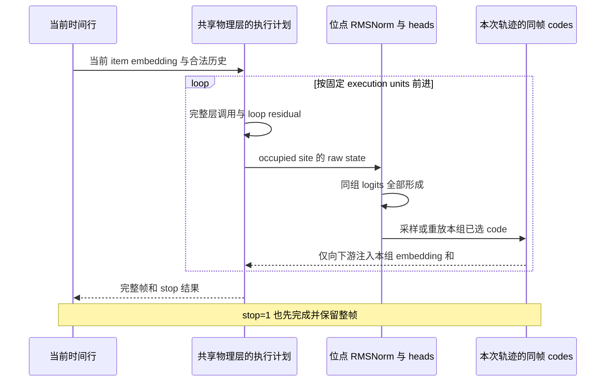
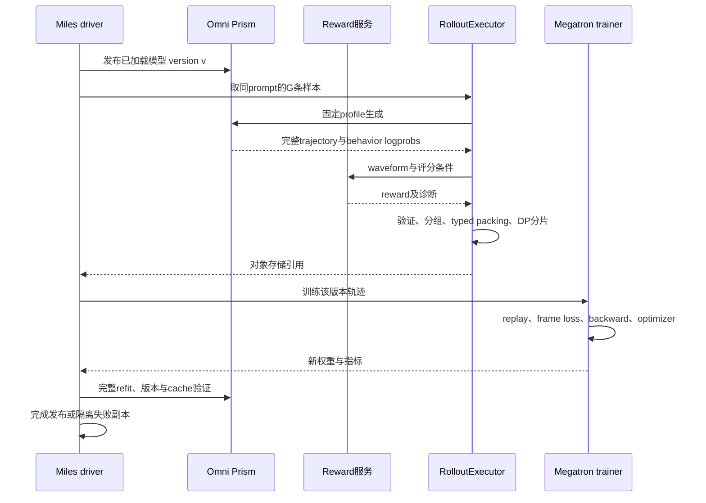

# Prism 接入 Miles RL：模型机制、策略目标与模块设计 RFC

> 状态：设计提案，尚未实施。本文仅新增分析文档，没有修改 mossLite、Miles 或 SGLang-Omni 的业务代码。适用源码：mossLite `43892a9b2797591fd6be35ae95066524ac984b1f`，Miles `f20b157888845b9523901f71dfaf8d95aceb538b`；分析日期：2026-09-12。
>
> 阅读对象：需要把 Prism 接入 Miles、并对动作概率、训练数学和分布式状态负责的工程师。主模式为 design RFC：先建立源码事实，再比较设计，最后规定可实现的接口与验收条件。本文是 **Miles RL 接入设计**，不替代 mossLite 的 canonical architecture、checkpoint 或 recipe 文档。

## 结论与推荐路线

建议采用 **“复用 mossLite 原生 Prism 模型 + Miles 内聚的 Prism policy module + 少量真正共用的接口”**。不要复制 Local 模型再改通道数，也不要把 mossLite 的整套 Megatron 训练入口接进 Miles。模型执行语义由 mossLite 维护；Miles 继续拥有 Ray 编排、rollout、奖励、optimizer step、checkpoint 与权重发布。

第一条可验证的路径是同步、全 RVQ 执行、固定 loop prefix、未过滤 softmax、温度 1、无标签平滑、无历史通道随机丢弃、无 stop-gradient，使用 WER 奖励与明确命名的 frame-joint GRPO surrogate。**如果 stop 纳入联合 PPO，Omni 必须真实随机采样 stop 并返回行为 logprob。** 假设 Omni 已经适配模型，不应顺带假定它已经满足这个额外的 RL 契约。

原生 Prism `forward` 当前没有 `return_logits`。它返回逐 head、未归约 CE；在上述受限分布下，`-CE` 就是可微 selected-action logprob。这使第一版无需复制 recurrence 或修改原生 forward。温度、过滤、精确 entropy/KL 和高效稀疏 readout 则需要未来由 mossLite 提供正式评分出口。[原生模型][P3]，[HF 模型][P8]

本次最重要的判断如下。

| 判断 | 工程后果 |
|---|---|
| Prism 在一个 backbone 的执行深度中预测 RVQ，没有独立 Local Transformer | 不复用 Local 的模型组合、帧内 Transformer 或 checkpoint mapper |
| 同一物理层可被多次调用，每个 occupied execution unit 有自己的 prediction norm | 参数按物理层存，计算/KV 按实际调用数算，norm 按 occupied unit 存 |
| stop 表示本帧完成后终止，末帧仍有全部 codes | `T` 帧对应 `T` 个 stop 决策；不能套 Local 的额外纯 stop event |
| reference conditioning 与 RL 动作 eligibility 是两件事 | 不能用 loss mask 控制 successor conditioning；prompt/reference/prefix 不计入本次动作损失 |
| target 输入只用 I，不代表只执行或只优化 I | 实际交付 I=1..8，但默认完整生成/重放 32 个 RVQ |
| 预训练 channel weights、平滑 CE 与 RL 行为概率不同 | SFT 168 权重分母不能进入 logprob 或 PPO ratio |
| mossLite 的 Megatron patch 改写了 checkpoint/训练基础设施 | 同一 Miles rank 内只能有一套受控 Megatron；先做兼容验证，不能靠 PYTHONPATH 覆盖 |
| Local 的 policy Protocol 尚未被统一 factory 接管 | 借第二种音频 policy 收敛已有接缝，避免再增加一轮散落的 `if prism` |

## 证据范围、假设与尚待确定的输入

### 已确认的源码事实

- mossLite 工作树位于 `/inspire/ssd/project/cq-scientific-cooperation-zone/public/kyu/editable/mossLite`，分支 `main`，本次读取时无工作树修改。
- Miles 位于相邻 `editable/miles`，仍是上一份分析的 `moss-tts-local@f20b15788`。原有未跟踪文件和文档草稿保留。
- mossLite 的 Megatron gitlink 为 `32ad5c89a6b6d7bb1ed75b81a4f845751d8955cc`，另有 canonical root patch；MossFlux gitlink 为 `865e84cf5f68c759469b57241012a940be98e82c`。[仓库约束][P0]，[checkpoint 契约][P10]
- Prism 模型、拓扑、数据投影、native training、双向转换器和 converter-scoped HF runtime 均存在；源码文档未声明已发布固定 Prism 模型 artifact。
- 本次直接运行 topology resolver，复算了默认模板与实际交付副本的层数、调用次数和预测位点，详见后文；没有执行训练 shell recipe。

### 对 Omni 的工作假设

本设计接受“Omni 已完成 Prism 适配”。因此不讨论如何实现它的 scheduler、KV kernel 或 vocoder，但会规定 Miles 消费的 trajectory、score、refit 与 capability 契约。**接口能被假设存在，具体采样语义不能被省略。** 例如现有 HF 代码 stop 为 argmax；Omni 如果延续该行为，不能直接使用本文随机 stop 的联合策略目标。

### 实施前需要拿到的信息

| 输入 | 目前状态 | 对设计的影响 |
|---|---|---|
| 实际要训练的 checkpoint 路径与 identity | 未提供；本文以受控拓扑分析，不凭模型名猜 checkpoint | 初始化、参数规模、tied/untied、norm 数量均应从 artifact 读取 |
| Omni RL capability/trajectory schema | 按用户假设实现完成，具体 schema 尚未作为本次输入 | 实施时映射到本文所需语义并跑 contract tests |
| stop 是 categorical 还是 argmax | 当前 HF 为 argmax；Omni 未指定 | 决定 joint PPO 是否成立 |
| 任务语言、是否有参考音频与 rubric | 未指定 | P0 以已有英语 WER 通路说明；中文/多语言必须独立定义 WER/CER 规则 |
| 优先目标是可懂度、音色、自然度还是推理效率 | 未指定 | 默认先验证可懂度闭环；组合奖励和可变计算是后续明确实验 |
| 训练 GPU、内存和宿主 Megatron 版本 | 未固定 | 只能给成本模型和验收方案，不能声称能在某卡数直接运行 |

这些未知不妨碍设计；本文不把尚未提供的 artifact 或服务结果写成已验证事实。

## 先理解 Prism 的四个维度

### 时间位置、RVQ 通道、物理层与执行单元

Prism 的一个 chronological item 是一个文本 token，或一整帧 audio RVQ codes。一帧的多个 code 描述同一个时间片，因此 32 个 RVQ 不占 32 个时间位置。一个 execution unit 则是普通单层调用，或一个 loop block 的完整应用；一个多层 block 的一次应用可能包含多次完整层调用。

| 维度 | 决定什么 | 不决定什么 |
|---|---|---|
| chronological position | causal attention 的时间轴、RoPE 坐标、文档边界 | 不随同帧 RVQ 或 loop 次数递增 |
| RVQ channel | 一帧的离散音频因子、对应 embedding/head | 不等于时间帧，也不保证某通道只对应某个感知属性 |
| physical layer | 参数注册、optimizer slots、checkpoint keys | 不等于一次前向中的调用次数 |
| execution unit / complete-layer call | recurrence、prediction site、虚拟 KV 历史和算量 | 不引入新的物理层权重副本 |

Delay 把通道依赖展开到延迟时间轴；Local 在 global hidden 后接独立帧内 Transformer；Prism 把依赖展开到同一 backbone 的深度与循环调用中。Prism 的后续细化层仍有跨时间 attention，不能当作每帧独立、可随意切走的 Local decoder。[架构说明][P1]，[中文解释][P2]

### 模型注册的模块

原生 `MossTTSPrismModel` 注册：一个 text embedding；每 RVQ 一个 audio embedding 和一个 audio LM head；一个 bias-free 二分类 stop head；一组物理 Transformer layers；每个 occupied execution unit 一份 prediction RMSNorm。

它没有 global final norm，没有 text LM head，没有 output modality router，不预测 `audio_start`、`audio_end` 或 tokenizer EOS。`audio_start` 是输入协议确定的控制 item，stop 是独立二分类输出。

Co-site heads 共用同一个 normalized raw state。不同 occupied units 的 prediction norms 不共享，即使它们对应同一 physical layer 的不同 loop application。Normalization 是读出支路：`norm(raw)` 不替代 recurrence 中继续传递的 raw residual。

### 当前输入与后继条件必须分开

令 `I` 是 `prism_input_rvq_channels`，`k` 是训练期目标历史保留 mask：

```text
h_pre(Text(token))       = E_text(token)
h_pre(ReferenceAudio(a)) = Σ_(q=1..Q) E_q(a_q)
h_pre(TargetAudio(a))    = Σ_(q∈I) k_q E_q(a_q)
```

每个位置只走 text 或 audio 一种入口。Reference 总是全通道；target current/history 才受 I 和保留 mask 控制，保留后的 embedding 不做反比缩放。中间 successor conditioning 使用的是“本行正在预测的下一帧”，它不受 I 限制。

定义 `C` 为同文档、同音频段内存在音频 successor；定义 `V` 为 C 且 successor 是 target。Reference 内部可以 C=1,V=0。Target 的 `audio_start` 虽是 text item，却可以 C=1,V=1。最终 reference frame 是 audio item，但后继是 `audio_end`，所以 C=0。代码不能用“当前行是 audio”代替 C。[模型输入校验][P3]，[数据投影][P5]

### 同一位点的原子性

在 occupied unit i、co-site group G_i：

```text
u_i       = prediction_norm[rho(i)](raw_i)
logits_q  = H_q(u_i), q∈G_i
stop      = H_stop(u_i), 仅 RVQ1 所在 group

先形成该 co-site 的所有 logits，再选择或重放其 codes。
之后 delta_i = C × Σ_(q∈G_i) E_q(successor_code_q)
仅当存在下游 unit 时，delta_i 才进入后续执行。
```

同组 heads 不条件于同组刚选出的其他 code；后续 group 条件于已完成的前面 groups。无 head 的 unit 只计算，不产生动作概率。Global final site 形成 logits，但不做无用的 outgoing embedding lookup。



## Loop recurrence：共享参数不等于普通加深

原生 `_execute_prism_schedule` 是核心语义。普通 unit 运行完整 Transformer layer，层内自带 attention/MLP residual，外面不能再加一次同样的 ordinary residual。

对于 loop block b，令 `anchor` 为进入 block 前的 raw residual，`A` 为显式 successor-conditioning accumulator：

```text
第一次：z_1 = Block(anchor + incoming_delta)
后续：  z_r = Block(z_(r-1) + anchor + A_(r-1))

reapply=false：下一次 accumulator 只保留本次新 delta
reapply=true： 下一次 accumulator 累加此前 accumulator 和本次 delta

block 退出：丢弃 accumulator，只向下一 unit 传 block-final 的新 delta
```

Anchor 与 conditioning 不同：anchor 对任何 item 都存在，不能按 C、V 或 loss mask 删除。第一次 anchor 只计一次；后续应用才有 previous raw + anchor。即使 reapply=false，以前的信息仍可能保存在 raw state 和 anchor 中，“不重注入 delta”不等于“抹掉历史条件”。

重复应用共享参数、optimizer slots、checkpoint keys、时间位置与 RoPE 坐标。它们不共享各自的 KV 历史。固定一份 physical layer 的参数，不意味着可以把不同 application 的缓存合并。[schedule 实现][P3]，[不可变拓扑][P4]

## 默认模板与实际交付配置：需要分开计算

本次从两个 shell 文件静态提取实际数组，直接调用当前 `_topology.py` 的 resolver；没有 source 或执行 shell。结果如下。

| 项目 | `recipes/train_prism.sh` | `docs/.../real_delivery_example.sh` |
|---|---:|---:|
| N_VQ | 32 | 32 |
| 物理层数 | 36 | 28 |
| execution units | 56 | 68 |
| 完整层调用次数 | 92 | 68 |
| occupied units / prediction norms | 32 | 32 |
| loop blocks | 8 | 8 |
| conditioning reapply | false / 0 | true / 1 |
| full prefix counts | 0,0,0,0,1,1,1,1 | 3,3,3,3,1,1,1,1 |
| target input channels I | 1..8 | 1..8 |
| 完整有效帧的 SFT 权重和 | 168 | 168 |

物理层数由 concrete topology 推导：若 M 为 head-count 向量长度，block 的物理长度为 len_b、重复次数为 r_b，则 `L = M + Σ_b(len_b − r_b)`。执行单元数与完整层调用数只有在每个 block 长度为 1 时才相等。不能直接给 Prism `--num-layers` 再假设它与 topology 一致。[拓扑契约][P1]，[模板][P11]，[交付副本][P12]

两个profile还分别使用reapply=false和true；这不只是性能配置差异，而是forward identity的一部分。即使某个简化拓扑碰巧算出相同结果，也不能抹掉该身份字段。

实际交付的路线是：

| 物理区间 | 应用次数 | 预测安排 | 到该组结束的累计层调用 |
|---|---:|---|---:|
| `[0,20)` ordinary | 各 1 | 无 heads | 20 |
| `[20,21)` | 4 | 第4次 RVQ1 + stop | 24 |
| `[21,22)` | 4 | 第4次 RVQ2 | 28 |
| `[22,23)` | 4 | 第4次 RVQ3 | 32 |
| `[23,24)` | 4 | 第4次 RVQ4 | 36 |
| `[24,25)` | 5 | 第2..5次 RVQ5..8 | 41 |
| `[25,26)` | 9 | 第2..9次 RVQ9..16 | 50 |
| `[26,27)` | 9 | 第2..9次 RVQ17..24 | 59 |
| `[27,28)` | 9 | 第2..9次 RVQ25..32 | 68 |

交付副本中残留的 “ordinary 0..15” 注释与数组不一致，应以实际 20 个零和 resolver 为准。这里是源码解释，不是对该副本进行修改。

交付宽度为 hidden=2048、FFN=6144、16 query heads、8 KV groups、head_dim=128，文本 padded vocab=155648，RVQ vocab=1024，RoPE base=1,000,000，I=1..8。`MODEL_SIZE=1.7B` 是宽度档名，不是任意循环配置下总参数量的精确声明。实际待训练 artifact 尚未指定，因此不能把这份 random-start 配方冒称已获得的预训练权重。

## Temporal core、detail refinement 与可变计算

在交付 profile 中，形成下一帧 target 初始入口所需的 RVQ1..8，需要前 41 次调用；完整 32 通道输出需要 68 次。后 27 次不向下一帧初始入口直接提供 I 之外的 codes，但它们仍有各自跨时间的 attention state，并与前段共享训练图。

应区分三种宽度：

1. `input_rvq_channels`：target current/history 初始 embedding 用哪些通道；是模型 forward identity。
2. `execution_rvq_channels`：这次生成实际执行到哪个通道所在 unit；必须覆盖 max(I)。边界 co-site 的完整执行单元保持原子。
3. `returned_rvq_channels`：最终给客户端返回多少通道；不改变已执行动作、内部 feedback 或缓存。

例如 execution=32、returned=8 时，RL 若按完整策略重放，必须仍保存 32 通道内部动作，不能只用公共返回的 8 通道。Execution=8 则是另一个执行条件，不能缺了后24通道却声称评估完整32通道联合概率。P0 统一 execution=returned=Q，降低协议分叉。

Loop prefix 可按 forward 显式传入，只省略各 block 最前面的无 head 应用，保留所有 heads 及其 canonical ownership。它是运行 schedule，不是额外可学习动作。若将来优化算力，应先做固定 schedule 的质量/延迟 Pareto 实验；当前 Prism 没有预测 prefix 数量的策略 head，不能仅添加延迟 reward 就宣称能通过 policy gradient 学会少循环。[HF channel 与 cache 契约][P9]

## 终止、首帧、截断与 continuation 的完整对齐

### Prism 和 Local 最容易混淆的地方

Local 的二分类动作可以出现“终止决策没有音频 code”的事件。Prism 的 stop 标记的是当前预测帧是否为最后一帧。自然终止时，T 帧有 T 个 stop decisions，前 T−1 个为0、最后一个为1，每帧仍有全部执行的 RVQ codes。

一帧 utterance 在 target `audio_start` 所在行直接预测整帧和 stop=1；无需再输入该帧去预测 EOS。不能添加 target `audio_end`，也不能删掉最后一帧 code 的 logprob。

### Replay 时间行示例

设提示的最后一行是确定性的 target `audio_start`，新生成 frames 为 A1、A2、A3。

| current row | successor payload | stop label | RL frame eligibility |
|---|---|---:|---|
| target `audio_start` | A1 | 0 | 是 |
| target A1 | A2 | 0 | 是 |
| target A2 | A3 | 1 | 是 |

A3 只作为最后一行的 successor/label，不再作为当前行。若 P 是包括 `audio_start` 的 prompt 当前行数，未提供 continuation prefix 时，训练 chronology 为 `S=P+T−1`。P0 拒绝 T=0 的不可训练空响应；不能为凑 tensor shape 造一个 stop event。

达到 max-frames 但模型最后仍选 stop=0 时，最后 label 必须保留0，termination 原因另写 `length_limit`。若同一最终允许帧真实选中 stop=1，则应按明确的服务契约记录 natural stop，而非根据长度相等机械判截断。技术性 abort 或半帧响应不是 length-limit 样本，不能补成完整轨迹。

### Reference 与 target prefix

Reference 保留 `audio_start → known frames → audio_end`，有合法 successor 的 reference 边可注入完整 co-site 已知 codes，但没有本轮 RL action loss。给定的 target prefix 也只提供条件；仅新生成 suffix 的 stop/codes 进入本次优化。Prefix 最后一个当前 frame 的 successor 可以是第一个新 suffix frame，它必须纳入合法重放。

不要从奖励音频反向重编码来恢复已采样 action：codec 解码/重编码并不保证恢复原始 codes。Trajectory 必须直接保存生成时的离散选择。

## RL replay batch：直接构造 typed carrier，不绕回 SFT 数据集

Prism 的 SFT 路径是 MossFlux v2 carrier → strict projection → run policy → weighted-token loss。RL 已经拿到确定的生成动作与终止原因，建议直接由 `PrismTrajectoryCodec` 构造 native model 所需的 typed carrier。

不建议把 rollout 先伪装成 MossFlux `generate` 数据再调用 `project_moss_tts_v2_batch`：它验证完整目标跨度、真实 terminal 和右截断语义，属于监督数据协议。RL 的 length-limited trajectory 不能通过伪造 `audio_end` 来满足该协议。应复用其因果不变量与验证知识，新增独立 RL projection 身份，例如拟议 `prism_rollout_to_native_v1`，不冒称产自原 SFT projection。

模型主体仍是同一个 native Prism；变的是输入来源及目标，不是 forward semantics。原 native model identity 中保存的训练 source protocol 不能被悄悄篡改，RL replay protocol 作为单独 envelope 描述并做兼容解释。

| native 输入 | 形状 | RL 构造规则 |
|---|---|---|
| `input_ids` | int64 `[1,S,1+Q]` | 每行只有 text 或完整 audio；text audio fillers=0，audio text filler=text_pad |
| `item_kind`、`audio_role` | int64 `[1,S]` | closed enum；不要把 user/assistant 等同于 reference/target |
| `labels` | int64 `[1,S,1+Q]` | `[stop,RVQ1..Q]`；有效 target edge 的 RVQ label 等于其 successor |
| `successor_audio_mask` | bool `[1,S]` | C，包含 reference、prefix、新 suffix 的合法后继边 |
| `successor_audio_codes` | int64 `[1,S,Q]` | 完整已知或生成的后继 payload；C=0处 filler0 |
| `rvq_structural_mask` | bool `[1,S,Q]` | 原生结构 target eligibility，逐行跨通道一致；与 suffix action mask 分开 |
| `target_history_retention_mask` | bool `[1,S,Q]` | P0 全1，模型内部仍按 I 选择 target 入口 |
| `packed_seq_params` | THD boundaries | 按独立 trajectory 划段；native 要求 position_ids=None、attention_mask=None |
| `loop_block_prefix_counts` | int64 向量 | P0 取固定完整 schedule，不能按每次训练重新随机 |
| RL 专用 `action_rows/frame_offsets` | 独立元信息 | 从 native CE 中精确 gather 新 suffix；保持 sample/frame/head 对齐 |

原生 batch size 强制为1。多个 trajectories 可以拼成一个 B=1 的 packed 序列，但要保留每条的边界、offset 和归一化身份；不能改成 B=2 以为与 Local 多样本 batching 相同。不同 realized loop schedules 不应放进一次只接受一个 prefix-count 向量的 forward；P0 固定 schedule 避开这个问题。

Native对inactive labels有硬性规则：V=0处的stop和RVQ labels必须全部为合法filler 0，不能用通用语言模型常见的−100，也不能将reference successor codes直接填进其labels。Code 0本身仍是合法audio action，是否有效只能由mask判断。

| 边正在预测的 successor | C | V | 本轮RL action mask | Native labels |
|---|---:|---:|---:|---|
| 已知reference frame | 1 | 0 | 0 | 全0；真实codes只在successor payload |
| 已知target prefix frame | 1 | 1 | 0 | 合法target labels，最终RL gather排除 |
| 新生成suffix frame | 1 | 1 | 1 | 本次rollout的stop/code动作 |

最后一个已知prefix frame→第一个新suffix frame属于第三类。不要为了屏蔽prefix损失，将所有以prefix为current row的C/V一并清零；资格由正在预测的successor决定。

Loss mask 不应切断 gradient path。Reference 和 prefix 没有直接 RL loss，不等于它们的 backbone 或 embeddings 不需要梯度；目标损失可通过历史因果 attention 和 successor lookup 回传。Code ID 本身不求导，lookup 所用参数和共享 state 需要重建计算图，不能复用 detached serving KV。[原生 validation/forward][P3]

## 模型概率、行为概率与三套参数

令 θ 为 current 参数、μ 为采集 rollout 的行为模型参数、ref 为固定 reference。令 σ 是固定执行 schedule，κ 是采样变换，H_t 是提示、reference、已知 prefix 和实际生成历史。对于随机 stop 与随机 RVQ，完整帧分解为：

```text
log πθ(d_t,c_t | H_t,σ,κ)
 = log πθ(d_t | H_t,σ,κ_stop)
 + Σ_groups G_r Σ_(q∈G_r)
     log πθ(c_t,q | H_t,c_t,G_<r,σ,κ_audio)
```

同组不相互条件化。Stop 和第一组 RVQ logits 在共同 state 上形成；即使 stop 提前读出，后续 code 仍生成，因此联合概率包含它们。无 head 的调用不增加概率因子。

采样变换 κ 包括温度、top-k/top-p、重复惩罚、任何 stop suppression、最短长度约束和强制动作。代码里的 `raw_softmax_logprob`、`temperature_scaled_logprob` 和实际 `behavior_logprob` 必须区分。服务返回一个叫 logprob 的数，不足以知道它是哪种分布。

P0 使用 `κ_audio=κ_stop=完整 softmax,T=1`、不做重复惩罚和额外 stop suppression。此时原生 `-CE` 才与原始模型 selected logprob 对应。是否与 Omni 数值相等仍必须测量，尤其 BF16/FP32 head 投影差异。

### top-k 的禁用值不要照搬

当前 Prism HF helper 用 `None/0` 禁用 top-k，并拒绝 −1；已有 Miles Local/SGLang recipe 常使用 `top_k=-1`。共享协议应表达语义值“disabled”，由各 transport adapter 映射，而非直接传递一个后端特有 sentinel。Top-p=1 表示无 nucleus 截断。[采样 helper][P13]

### 非 P0 分布需要什么

温度≠1 要在 logits 上重算归一化；只有一个已选 code 的原始 logprob不足以推出另一温度的 logprob。重复惩罚需要完全相同的实际历史，包含是否排除 prefix 的规则。Top-k/top-p 的候选集由当前 logits 决定，可能造成新旧 support 不一致；即使采样动作的分母非零，也不能声称有限样本比率解决全部支持问题。可选固定行为 support 或完整新策略 support 是不同算法，必须有新 objective/profile 名称及验证，不能隐藏在“兼容采样设置”里。

## Stop 训练：两条不同且不能混称的路线

### 推荐：随机 stop 的完整联合策略

Omni 真实从二分类 categorical 分布采 stop，并保存动作与行为概率；最后一帧全部执行后生效。这样 stop 与 audio 一起构成可微、支持明确的随机策略，WER、截断惩罚和长度约束能通过 score-function 梯度作用于 stop 以及共享状态。

这是 RL contract 的决定，不是现有 HF 默认事实。当前 HF `generate` 使用 `argmax(stop_logits)`；还默认 audio_temperature=1.7、top_p=.8、top_k=25，均不符合 P0。实施时应显式协商能力，不用默认值。[HF generate][P8]

### 如果继续使用 deterministic stop

真实行为 stop 分布是 `qμ(d|H)=1[d=argmax zμ_stop(H)]`，已选类别的概率为1，logprob为0。不能拿 softmax 概率伪装成实际行为概率放入 PPO。

Audio-only optimization 可把 stop 当终止规则，但必须承认其局限：只冻结 stop_head 不足以固定规则，因为共享 backbone 和 prediction norm 更新也会改变 stop logits。如果 current 与 old 的 argmax 改变，轨迹支持与终止状态可能改变，省略 stop 指示函数的 audio ratio 不再是完整策略比率。

可明确选择：

- 独立、完全冻结的 termination policy，保证终止规则相对被训练 audio policy 的参数不变；需要额外模型/状态与成本。
- 接受 audio-only semi-gradient surrogate，监控 stop-flip、长度和截断变化，不宣称完整 joint PPO。若加入 stop KL/CE，那是另外的正则或监督项，并未补上缺失的真实行为概率。

不推荐一开始同时支持两种模式并复用同一个 objective 名称。P0 首选随机 stop；若产品必须保留 argmax，建立单独试验分支并明确评估目标。

## 先定义业务目标，再定义优化 surrogate

### 业务目标

Prism 的结构本身不决定唯一 RL reward。可以将最终目标写为：

```text
J(θ) = E_(x~D, τ~πθ)[R_quality(x, waveform(τ))]
       subject to 内容完整性、说话人条件、终止安全界限和计算预算约束
```

第一阶段先验证“读对并读完整”。第二阶段再加入说话人相似度、自然度、情感/韵律指令；第三阶段才考虑执行深度或实时性。把三个阶段同时优化，很难区分模型、评分器和系统延迟变化各自的贡献。

### WER 奖励的具体契约

原始 WER=`(substitutions+deletions+insertions)/reference_words`，可大于1。现有Local有两个不同入口：直接`wer_reward`对健康英文转写保留unclipped WER，返回`1−WER`，允许负奖励；`reward_composite`再通过`bound_reward`把WER分项截到[0,1]。两者不能笼统视为同一有界约定。

本RFC的P0选择明确的有界版本：健康样本`effective_wer=clip(raw_wer,0,1)`，质量规则判定无效时置1，再设`R_wer=1−effective_wer`。这会让WER≥1的样本同分，与直接Local WER-only入口不同，必须在objective/reward profile中记录，并监控低分饱和组。若希望保留严重错误间的排序，可另立unclipped reward消融；不能无记录地换入口。Raw WER与错误计数始终保存用于评估。

建议 profile 记录文本归一化版本、语言/分词规则、ASR checkpoint、重复识别次数、聚合规则、空文本规则、无效语言/异常词速/截断处理。已有英语 Local 的三次识别中位策略可作为候选，但不自动适用于中文。中文应先定义 CER 或可靠的词切分 WER，并与业务验收对齐。

技术失败与模型质量失败分开：ASR timeout/鉴权失败/格式损坏是 retry 或中止，不伪装 reward=0；生成结果可解码但内容空、截断、语言错误等才按预先定义的质量规则处理。Prompt group 失去样本时按统一完整性策略重试或整组排除，并记录采样偏差，不能 silently 缩小 G。

### 组合 reward

| 分项 | 需要的数据 | 主要局限/校验 |
|---|---|---|
| WER/CER | 合成目标文字、ASR 转写 | 可懂度代理，不等于自然度 |
| SIM | 唯一有效 reference 音频、候选 artifact | 主要约束 speaker/timbre；需校准服务原始 cosine 与有界分数 |
| Judge/RM | 明确 rubric、音频、指令、固定模型和 tokenization | 模型偏差、分数饱和、语言偏差；不能把噪声当微小提升 |
| duration/termination | 目标长度条件、真实帧数、stop/limit 原因 | 过强长度奖励可能鼓励提前结束；与内容完整性共同约束 |
| latency/compute | 固定硬件/并发/执行 profile 的观测 | 系统噪声大；当前固定 schedule 没有可学习 loop-choice 动作 |

可以使用 `R=w_wer R_wer+w_sim R_sim+w_rm R_rm−λ_failure P_failure`，但数值范围与归一化要显式。若继续沿用 Local `reward_composite` 的凸组合约定，权重需非负且和为1，它不会自动归一化，不能偷偷加入可能为负的 penalty 再声称仍在[0,1]。另一种合法设计是定义独立的 unrestricted scalar objective，并同步 reward/postprocess/metrics 契约。

建议初始 WER-only，待正负控、held-out 和无更新 repeat 稳定后做单变量组合实验。SIM/RM 的具体权重由校准和验证选择，本文不给未经实验的“最佳比例”。

## 推荐 RL objective：Prism frame-joint GRPO v1

该名称是拟议 objective ID，尚不存在于当前 Miles。选择它是为了复用 Local 已经处理过的帧级统计与样本归一化经验，同时保持 Prism 自己的动作模型。

对同一个 prompt 的 G 条输出计算 reward。P0 使用去组均值、不除组标准差的 advantage，以减少近零方差时噪声放大；若改为标准差标准化，则应固定 epsilon 与 group 处理规则并记录 objective 配置。

```text
A_i = R_i − mean_j R_j                 # P0，G固定且G>=2
ell_i,t = logp_stop_i,t + Σ_q logp_code_i,t,q
delta_i,t = ell_current_i,t − ell_behavior_i,t
r_i,t = exp(delta_i,t)

L_pg = −(1/B) Σ_i [ (1/T_i) Σ_t
          min(r_i,t A_i, clip(r_i,t,1−eps_low,1+eps_high) A_i) ]
```

三层归约不得混淆：head 内求和构成联合概率；sample 内按有效帧平均；sample 之间等权。全宽随机 stop 的32通道帧有33个概率项，但不是33个时间位置。

Behavior logprobs、sample rewards和advantages在当前优化图中都是常数；一个rollout batch的所有optimizer steps/epochs都使用采集该batch时确定的分母，不得每次forward替换成`current.detach()`。P0虽只做一步，也应从接口上固定这个生命周期。RLOO的reward和leave-one-out baseline同样stop-gradient。

**这是明确的 GRPO/PPO surrogate，不是无偏句级期望 reward 梯度。** `1/T_i` 改变长短轨迹权重，clipping 与组优势也是算法选择。业务目标 J 和实际优化 surrogate 必须分别记录。GRPO 的组基线思想与 PPO clipped objective 的背景可参见 [DeepSeekMath][R2]、[PPO 原论文][R1]；这里的 Prism 动作分解与实现限制来自源码分析，不是这些论文已验证的语音结论。

### 为什么 joint logprob 不能平均

若32个 audio heads 的 current−old logprob 各为0.03，忽略 stop 项以便演示：联合 ratio=`exp(32×.03)=2.6117`；先平均再取 exp 得1.03045。两者的 clipping 行为完全不同。把均值称为“数值稳定”会暗改算法。

高维乘积确实可能导致 frame ratio 很快超 clip。应记录逐 head、逐 site、逐帧 delta 的分布、正负 advantage 的 clip fraction 与有效更新比例；先通过小学习率/更少优化步和严格 parity 控制更新幅度。若仍过强，再比较 site-wise 或 factor-wise clipping，作为单独 objective 消融。

在 log-space 判断 clipping 或采用稳定实现是数值策略；将 delta 除以Q、隐藏大范围 clamp 或丢掉 stop 是数学目标变更。极端非有限值应中止更新并保留诊断，不把它当作正常 clip。

### 数学正确性对照：REINFORCE/RLOO

另设一个仅用于验证和可选实验的对照：

```text
b_-i = mean_(j!=i) R_j
A_i = R_i − b_-i
L_anchor = −(1/B) Σ_i A_i × Σ_t ell_current_i,t
```

在 current=采集策略、同 prompt 独立采样、baseline 对当前样本动作独立、没有 clip、没有按随机长度除法的条件下，这是期望句级 reward 的 score-function 梯度形式；可乘固定常数控制尺度。它用于核对完整轨迹梯度、stop 和联合因子的连接，不宣称方差或质量优于 practical GRPO。

固定G时组均值 baseline 包含当前样本 reward，会相对 leave-one-out 产生 `(G−1)/G` 的常数尺度；G变化时该尺度也变。不能把变长输出归一化、reward分组与DP平均都叫作“等价平均”。

### 备选目标的区别

| 目标 | ratio/归约单元 | 取舍 |
|---|---|---|
| frame-joint GRPO | 每帧全部概率项求和再 clip | 与完整帧动作一致；32通道联合误差/更新容易放大 |
| site-joint GRPO | 每个 co-site 概率项联合后 clip | 控制单个位点变化；不再等价于整帧 clipping，stop/第一组归属需明确 |
| factor-wise clipped PG | 每个 RVQ/stop 单独 ratio | 更细粒度，可能弱化联合约束；不同heads的梯度权重须明确 |
| trajectory ratio | 全句 logprob 求和再 exp/clip | 真正整条行为比率，但长语音可能高方差/严重clipping |
| 按head平均log-ratio | 概率比几何平均 | 是不同surrogate，不叫完整联合ratio |
| raw REINFORCE/RLOO | 整句 logprob求和、无clip | 理论对照清楚；方差和尺度需处理 |

不建议第一版同时引入这些变体。先固定一种可审计目标，其他以相同prompt/seed/reward/算力对照。DAPO 对 token 与 sample 归约差异的讨论说明归一化会改变训练，但不能照搬文本结论替代 Prism 的帧级实验。[DAPO][R3]

## KL、entropy、SFT anchor 与 MOPD 的定义

### P0 先不把诊断量冒称正则

P0 可先设 reference KL coefficient=0、entropy coefficient=0，完成行为概率和真实更新闭环。当前 Local 的 `approx_kl=old−current` 是采样诊断，未给 loss 添加 reference KL，也不保证每批非负。

后续推荐明确的正则是：在 behavior 轨迹重放所访问的条件状态上，逐 head 计算 categorical `KL(current || reference)`。必须说明方向、分布变换、head/frame/sample归约和状态来源。后续site的条件来自behavior earlier codes，因此这不是“current自己访问状态上的完整trajectory KL”。精确categorical KL需要完整归一化分布或模型提供的统计出口，单个selected logprob差不能自动替代。

Entropy 同样要区分单个conditional head的entropy与完整轨迹entropy。可计算行为轨迹状态上的conditional entropy regularizer；不是对整条当前策略语音分布做了精确求和。

### SFT anchor 可复用预训练目标，但必须单列

若需要保留音质/终止行为，可在独立高质量监督数据上加 `lambda_sft L_sft`。Prism原来的channel weights、label smoothing和weighted-token reducer可用于这个监督项，但不可乘入行为logprob。RL与SFT分开batch、mask、normalizer、日志和checkpoint objective配置；不能用一份已经加权/平滑的CE同时做PPO分母。

### MOPD：需要兼容的教师和matched scoring

可迁移Local经验：把同一条Prism trajectory交给固定teacher和随student同步的prefill scorer，取 `clip(logp_teacher−logp_student_prefill,−a,a)` 作为逐factor/site信号。Paired scorer使用相同codes、拓扑条件、温度和batch context，先做same-weight零信号负控。

Teacher与student至少要共享codec code含义、RVQ数量/对应、stop语义和能解释同一trajectory的输入协议。Prism与Local或Delay并不能因都叫TTS就直接做逐code蒸馏；不同codec/动作空间要额外的对齐设计。不同Prism拓扑可以在明确兼容动作空间下比较，但不能共用同一model-identity hash来掩盖差异。

MOPD优势是distillation signal，不是WER质量证明。教师没有领域能力时，零信号/非零gradient canary只能证明实现接通。P0不同时加入MOPD与异步；先避免教师显存/调度与旧策略年龄混在一个实验中。

## 如何在 Miles 中接得更好：三个候选方案

本次按模块设计方法比较了三个不同方向。接口不仅是方法签名，也包括不可变量、顺序、失败模式和性能条件。好的模块应把Prism知识集中起来，而不是把十几个回调都暴露给caller。

| 候选 | 做法 | 优点 | 主要代价 |
|---|---|---|---|
| A：最小PrismPolicyProgram | bind模型，replay轨迹，export规范权重；native模型直接复用 | 接口小；初版可用raw CE；不复制架构 | 初始分布范围窄；仍需宿主MCore兼容 |
| B：版本化执行内核+ports/adapters | mossLite交付独立模型执行/selected-score内核，Miles绑定backend与trajectory | 多模型/多backend长期locality好 | 需要跨仓库交付、迁移与兼容成本；容易过度抽象 |
| C：专用PrismWerGrpoPolicy | 对最常见同步WER调用隐藏全部细节 | 用户配置简单；容易建立首个验证闭环 | 若让它另起训练循环，会与Miles生命周期重复；扩目标时接口可能膨胀 |

推荐 **A 的实现路径 + B 的必要接口收敛 + C 的默认recipe体验**。实际仍使用Miles现有train.py/TrainerController/optimizer schedule；不要新建第二个train_sync_step运行系统。也不要把“抽出全部模型执行内核”变成首个RL实验前的巨大重构任务。

最小值得统一的三个接缝是：trajectory到训练表示；模型到selected-score；训练参数版本到Omni发布。Local和Prism都真实需要它们，因此不是为假想第三模型添加抽象。

## 推荐模块职责与依赖方向

以下名称均是未来设计，不是现有接口或可立即运行的代码。

```text
policy_registry.resolve(policy_family) -> PolicyDefinition

PolicyDefinition
  rollout codec / validation / cost estimator       # CPU可导入
  training factory -> PrismTrainingBinding           # GPU rank才加载模型依赖
  weight adapter / artifact identity                 # 规范映射

PrismTrainingBinding
  model                                               # Miles拥有DDP与optimizer
  replay(batch, score_request) -> SelectedScores       # 可微模型输出
  optional objective adapter -> loss numerator/count  # 不调用optimizer.step

Trainer runtime
  owns current/old/reference versions, optimizer, RNG, save/resume
  invokes replay/forward through existing Megatron schedule

Omni transport
  owns HTTP/NCCL control transaction, consumes policy WeightManifest
```

### 建议保持的原则

- `policy_family` 只在registry解析；CPU rollout模块不import Megatron/TE来反序列化一个Sample。
- `rollout_backend=sglang_omni` 决定transport，而不是从某个Local家族名推导后端。
- 共用的是trajectory envelope和分数归约契约，payload仍用具体Text/Local/Prism类型；不强迫三者共用一张含大量空字段的tensor。
- Workflow不接受整个Ray actor做`Any`逃生口。快照切换、发布版本、profiler和checkpoint通过小而明确的runtime能力注入。
- Optimizer/lifecycle属于训练backend，reward HTTP属于reward module，模型replay不建Ray actors、不读secret文件、不调用网络服务。
- 常量Q、topology、norm数量、text/codec identity来自artifact；不在controller、mask或metrics里写32/12。
- 为纯计算增加转发层没有价值；真正可替换的Omni HTTP/in-memory adapters与外部ASR production/mock adapters才值得暴露依赖接口。

当前`policies/base.py`已经声明几个Protocol，但文档中提到的registry并不存在；模型提供、数据转换、controller、快照和OmniWeightTransfer仍硬编码Local。应先把已有具体实现挂到明确的解析结果上，再接Prism，避免在每个位置增加第三个分支。[Miles policy 接口][M1]，[Megatron actor][M2]，[Omni refit][M4]

## Native 模型复用与 Megatron 兼容策略

### 首选：复用模型数学，不复用整套训练应用

优先导入固定版本的Prism model/config/identity与必要embedding实现，并由Miles的model provider包装为现有训练rank模型。P0使用native未平滑CE抽取概率；不复制`_execute_prism_schedule`，不继承Local两段模型，不用forward hook截取私有输出。

mossLite `model.py`本身依赖MCore `LanguageModule`、`TransformerBlock`、词表并行层、packed THD、RoPE及padding-aware embedding。Miles要验证这些与自己的宿主MCore可兼容。不要把整个`mossLite/Megatron-LM`放到PYTHONPATH前面：mossLite的checkpoint saver/loader已被无条件改为TTS逻辑协议，要求识别架构，且没有普通Megatron fallback。[依赖与patch约束][P0]，[checkpoint契约][P10]

### 实施时的版本门槛

1. 固定Miles、mossLite、MCore、TE、FlashAttention、Torch、Omni与codec/tokenizer版本。
2. 在一个新的可控训练环境中验证Prism模型类对Miles宿主MCore的构造、TP metadata、forward和DDP行为；当前分析不安装依赖。
3. 把必要MCore差异收口在`native_adapter`或经审阅的upstream兼容改动，明确每项patch；不静默替换checkpoint模块。
4. 对比相同tensor权重、typed batch的native参考与Miles模型：逐head score、梯度、optimizer更新、checkpoint round-trip。
5. 若当前两个MCore版本不兼容，暂停该实施关卡并先解决兼容；“复制一个模型文件”不会自动消除MCore语义差异。

还要迁移原生training entrypoint中未必由model constructor重复执行的校验。例如tied/head-authoritative模式与`overlap_param_gather`的限制写在Prism `train.py`；绕过该应用入口直接构造model时，Miles adapter必须显式保留。P0统一关闭overlap_param_gather，不能认为“原生模型构造成功”就已经覆盖全部运行规则。

### 不推荐作为主训练路径的办法

HF runtime可作为小模型golden oracle，但不应为了方便取得logits直接取代Megatron训练backend。它的stop FP32投影、缓存实现、参数注册/并行/optimizer规则与native不同；应先做明确的backend方案，而非隐式混用。

对raw native CE的P0路径，`label_smoothing=0`必须在模型配置中固定；SFT运行参数即使未进model identity也可能改变输出CE。`temperature=1`、filters disabled和repetition=1是score capability的限制，模型绑定应在训练前报错，而非返回一个看起来合法但语义错误的logprob。

## 高效 selected-score 接口：后续在 mossLite 增加什么

原生模型当前先保留各head logits，再统一算CE。设S=20,480、Q=32、V=1,024，仅RVQ logits在FP32下就占2.5GiB，BF16存储也有1.25GiB；这只是输出张量估算，不是总训练显存，尚未包括backbone激活、梯度、临时softmax和optimizer。

后续建议让模型拥有一个正式的readout/reduction模式：同组全部logits形成后，在其生命周期内计算所需selected logprob、entropy或reference统计，再释放无用词表维度。训练返回 `[frames,Q]` 和 `[frames]` 等分数，而不是把 `[S,Q,V]` 暴露给Miles长期保存。

该出口与SFT CE共享同一topology traversal、prediction norm和conditioning路径。不能为节约显存先注入一个head的code，再算同组另一个head；也不能根据RL loss mask跳过需要用于conditioning的heads/embedding操作。

仅计算有效prediction rows可以减少head投影，但这属于需要独立数值/梯度验证的优化：reference及prefix rows仍参与backbone和后继条件，co-site原子性、TP词表collective顺序及GPU内存释放时机不能改变。P0接受较保守实现，后续profile后再决定优化位置。

## Trajectory envelope：建议的正式协议

拟议`PrismTrajectoryV1`不是现有Local schema v2，也不是Prism model identity schema3。建议分开版本号，避免“schema=3”同时指三件事。

| 分类 | 字段/要求 |
|---|---|
| 外层身份 | trajectory_schema、policy_family、sample_id、group_id、request_id、prompt_digest |
| 模型身份 | 完整Prism identity/hash、权重版本、artifact digest、tokenizer/processor identity、codec identity |
| 输入条件 | typed prompt rows、reference frames/边界、已知target prefix及hash；不只保存自然语言文本 |
| 输出动作 | 完整内部suffix codes `[T,Q_exec]`、stop actions `[T]`、每项是否真采样或被强制 |
| 行为概率 | actual behavior stop/code selected logprobs；分布语义版本；原始logprob可另存audit字段 |
| 执行条件 | canonical topology hash、realized loop prefix counts、I、reapply、execution/returned widths |
| 采样条件 | stop/audio temperature、filter语义、repetition规则、min/max frames、forced-action策略 |
| 终止信息 | model_stop、length_limit、abort、error；完整帧数、有效码本数、最终真实stop |
| 输出媒体 | waveform artifact、sample_rate、codec配置、内容hash；与codes的来源关联 |
| 评分 | reward status、分项值、评分器版本、reference/rubric身份；technical failure与quality failure分开 |

Validator至少检查：一个trajectory单版本；Q匹配执行宽度；所有codes合法；selected概率有限；自然stop最后为1且之前为0；length-limit不伪造stop；完整内部codes没有被return-width裁剪；prefix/schedule/采样能力可重放；group内条件一致。

Tokenizer special token IDs、codec采样率不从Local复制。Prism当前config和HF runtime的默认值不等于某个实际artifact的契约，尤其文本vocab与control IDs必须匹配转换时的runtime-assets。

## 权重映射、发布事务与 KV 失效

### Prism 独立的 tensor inventory

| 训练侧 | serving侧/解释 |
|---|---|
| `text_embedding.word_embeddings.weight` | `transformer.embed_tokens.weight` |
| `audio_embeddings.q.word_embeddings.weight` | `audio_embeddings.q.weight` |
| `audio_lm_heads.q.weight` | `audio_lm_heads.q.weight` |
| `stop_head.weight` | 二分类stop；显式处理serving FP32投影/存储约定 |
| `prediction_norms.k.weight` | 每occupied unit的独立norm，保持dense ownership次序 |
| physical decoder layers | HF Q/K/V、O、gate/up/down、各norm；按converter映射而非猜命名 |

Native logical DCP把8种Transformer tensor沿物理层stack，schema条目数为`10+K+2Q`；K=32,Q=32时是106。HF逐层schema条目数是`2+K+2Q+11L`，交付L=28时为406、模板L=36时为494。它们是不同namespace的inventory条目数，**不是参数张量唯一对象数或内存容量**。Python in-memory parameter names也不等于DCP stacked keys，不能直接逐字符串替换。[转换器schema函数][P7]

没有global `transformer.norm`、没有text LM head、没有local Transformer。循环68次不会导出68套backbone权重。Tied模式中audio LM heads同时作为lookup权威，另存audio embeddings冻结但仍属于artifact inventory；不能擅自合并或丢弃。

当前Miles OmniWeightTransfer硬编码Local adapter与manifest，并对Local特定的`text_lm_head.weight`做排除。需要把model-specific inventory与映射交给当前policy的weight adapter；通用transfer只执行传输/验证/发布流程。[Miles weight transfer][M4]

### 发布状态机

```text
candidate created
 -> quiesce/drain generation
 -> prepare receiving version
 -> transfer all canonical tensors
 -> validate exact inventory + identity + per-replica version/checksum
 -> invalidate every affected virtual KV/cache state
 -> commit published version
 -> resume generation
```

任何一步失败都不得发布新版本或让半更新副本恢复服务。版本号一致不能替代tensor inventory/checksum；暂停请求不能替代旧KV失效。是否能回滚到旧权重取决于具体Omni事务实现，本设计不假设数据库式原子回滚。失败后可隔离副本并重新完整refit，完成验证后再加入生成。

虚拟KV slot按实际complete-layer调用区分。交付完整schedule对应68个调用历史，I=1..8的execution前缀对应41；它们是瞬态运行状态，不进weight checkpoint。Cache identity至少绑定weight version、schedule、执行宽度、模型forward identity及相关输入/条件；同样的文本prompt不能证明深层KV可复用。

## 初始化、RL checkpoint 与恢复语义

### 三种artifact各司其职

1. **mossLite pretrained/native release**：只初始化模型参数及forward identity，不恢复Miles RL数据cursor或optimizer。
2. **HF serving artifact**：提供Omni可加载权重与runtime-assets；conversion成功仅说明结构契约，不等于真实语音质量验证。
3. **Miles RL run checkpoint**：恢复当前模型、optimizer/moments/step、scheduler、RNG、rollout/data progress、RL objective配置与版本协议。

初始化优先使用有完整identity的严格转换路径，并核对tied/untied与prediction norm schema。不要尝试把mossLite supervised training_state当成Miles RL resume。如果确需继承优化器，要单独定义迁移语义，绝不能仅因state_dict.load没有报错就认定可延续同一训练轨迹。

### 建议新增的 RL run manifest

保存model identity、policy/objective/schema版本、reward规则与服务版本、sampling/execution profile、trainable scope、I/reapply/prefix、normalization规则、old-policy来源、published version、optimizer backend/sharding、训练step与数据group cursor。该manifest是Miles RL自己的契约，不向mossLite严格checkpoint.json里添加它不接受的字段。

模型identity未包含的训练参数也可能影响resume语义，例如smoothing、retention、loss include、stop-gradient和recompute。Miles的RL profile应固定并在resume比较这些值，而不是依赖原native“operator自己保持一致”的口头约定。

P0同步保存：只在一个batch完成、没有未处理trajectory时保存；恢复后先完整refit加载权重，再生成首批。Serving version可以在新run epoch下重新建立，但必须明确命名空间；不能把旧服务cache当成新训练rank的有效状态。

## 并行、梯度累积、recompute 与成本估计

### 首期支持范围

P0从TP=PP=CP=1、单trainer GPU、DDP语义、recompute off、无sequence parallel开始；随后增加DP2并验证梯度缩放和resume。先用不分片optimizer建立reference，若内存要求distributed optimizer，则把真实sharding/save-resume验证列为进入该profile的前置关卡。

Prism native的部分TP支持、CPU/Gloo测试或单H200 TE梯度测试，不自动等于Miles宿主环境支持TP/NCCL、distributed optimizer或长跑resume。当前native明确拒绝FSDP2训练路径的特定梯度归一化/优化器恢复问题；Miles有FSDP backend也不能直接推出Prism可用。[支持与证据边界][P1]

### 共享层的梯度保护必须保留

Prism固定`disable_parameter_transpose_cache=True`，使TE收到`is_first_microbatch=None`，避免共享物理层多次调用的fused wgrad在首轮backward被覆盖。必须测试“无warmup、第一次backward”和连续microbatch；只比较第二轮可能漏掉问题。

Activation recompute与conditioning reapply是两回事。Native目前的受限recompute路径是TP1、full/uniform、每个真实完整层调用一checkpoint region、num_layers=1且不分发saved activations。Prediction reads、norm、head和conditioning不在重算region中。共享层重算与overlap_grad_reduce组合受限；stop-gradient也有单独overlap限制。P0不启用它们，后续逐项验证。[recompute policy][P14]

### 正确的microbatch归约

每条trajectory先算其平均帧loss。一个物理microbatch返回这些sample losses之和，并返回sample count；外层保证一次global batch只除全局sample数。Megatron schedule如果还会按microbatch数缩放，需要在adapter中明确抵消/协调，不能凭Local的公式复制一个系数。

必须比较同一批轨迹在单条、packed、不同microbatch划分、DP1/DP2下的loss/gradient/parameter update。不能让“更多短语音塞进同一个pack”使它们整体变轻，也不能按执行cost替代数学normalizer。

### 调度成本

Chronological length仍用真实S，不乘68再送入RoPE或mask。另提供估算：

```text
estimated_work ≈ L_eff × [a Σ_i S_i H² + b Σ_i S_i² H]
                 + c Σ_q N_read_rows,q H V_q
```

L_eff来自实际schedule；S_i是pack内独立文档长度；N_read_rows取决于实现是否dense计算所有行heads。a/b/c需要profile校准，不是已测常数。FlashAttention的二次计算项也不能直接当成二次显存分配。

参数/optimizer成本主要看物理层和norm/head数；激活与计算看实际调用、重算和head readout；服务KV看virtual slots和context长度。建议调度器分开记录`chronological_positions`、`effective_calls`、`prediction_rows`、`estimated_activation_bytes`。只有长短不同、同一固定topology时，可先使用长度近似并加保守cap；不要照抄Local的“最多2条”当成Prism已经验证的安全值。

## 同步训练时序与后续异步设计



不需要新增Prism专用Ray coordinator或让Omni进入Miles GPU allocation。TrainerController/TrainerCell仍是控制对象，RolloutExecutor仍负责CPU轨迹与reward；每trainer rank持有Prism模型。

异步应在同步真实更新与checkpoint验证之后再接。复用Local“一批预取”的经验，但把snapshot接口从Local私有字段中收敛出来：runtime拥有版本→不可变参数快照，提供leased replay，并保证finally恢复current，workflow不直接调用actor._switch_model。

真实server behavior分母若已保存且语义/数值过关，异步训练无需为了得到旧分母强制重算旧模型；可保留快照做审计或在明确的trainer-behavior近似模式中使用。后者只能说解决权重年龄，不能说自动变成实际decode行为策略。不要把当前detached scores填给陈旧trajectory。

初始异步profile仍限单步lag、每batch一个optimizer step、publication间隔1、发布前drain整批生成。Checkpoint要么drain全部pending batch，要么完整保存queue、cursor、sampling state和快照租约；后者尚需独立协议。P0采用drain保存。

## 从 Local 复用什么，重写什么

| 内容 | 处理建议 | 原因 |
|---|---|---|
| Ray driver/TrainerController/worker manager | 复用 | 训练生命周期不随Prism recurrence改变 |
| Megatron train/forward schedule扩展点 | 复用并验证normalization | 已能接custom forward builder |
| Object store、DP调度框架 | 复用机制；新增Prism adapter/cost | 不伪造text token长度 |
| Frame clipped-loss纯数学 | 可提为共享函数，保持sample reduction契约 | Local/Prism都能提供frame joint scores |
| WER/SIM/RM pure scoring | 修复边界后抽出audio reward module | 不依赖Local trajectory类或固定48k/Q |
| Composite reward metrics/config | 统一Result schema后复用 | 上一轮已发现producer/metrics漂移 |
| Omni HTTP/NCCL transport | 泛化identity/manifest注入后复用 | transport不应知道某个Local模型名字 |
| Local trajectory、batch、trace_codec | Prism新实现 | stop、typed input、C/V、Q、positions语义不同 |
| Local model/local_transformer/policy | 不复用模型计算 | Prism分深度共享backbone，无独立local decoder |
| Local checkpoint/serving mapper | Prism按converter契约新实现 | 参数key、norm ownership、DCP布局不同 |
| Async版本经验 | 复用规则，收口runtime快照接口 | 不复制_moss_snapshot_versions等家族私有字段 |

上一轮确认的SIM统计`mixed_reward`错误、RM env值误删首尾、MOPD sparse-domain resume覆盖manifest问题，应在公共奖励/教师模块复用之前修复并补跨接口测试。本次没有修这些代码；它们也不是Prism模型架构缺陷。[既有Miles分析][M9]

## 建议的文件布局与现有文件改动点

以下均为未来实施清单，不表示文件已创建。首期不要求一次建齐所有抽象目录。

| 拟新增/收敛位置 | 职责 |
|---|---|
| `miles/policies/registry.py` | 一次解析policy definition，lazy加载GPU部分，text默认行为保留 |
| `miles/policies/base.py` | 小型通用envelope/score/runtime能力；减少actor:Any泄漏 |
| `miles/policies/moss_tts_prism/spec.py` | 从artifact读取、验证model identity与支持profile，不写死交付参数 |
| `.../types.py`、`trace_codec.py` | PrismTrajectory、终止/采样/执行字段及CPU校验 |
| `.../batch.py`、`rollout_data.py` | trajectory→typed native inputs，suffix action rows、THD与DP schedule |
| `.../native_adapter.py` | mossLite model/config对宿主MCore的唯一兼容位置 |
| `.../policy.py`或`program.py` | model binding与selected score replay；不持有HTTP和optimizer生命周期 |
| `.../workflow.py` | 在Miles已有train helper中接入Prism forward/loss，不复制Megatron loop |
| `.../loss.py`或共享frame loss模块 | 明确命名的Prism objective与normalizer、诊断 |
| `.../checkpoint.py` | model-only初始化与Miles run manifest/resume区分 |
| `.../serving_weight_adapter.py` | converter-owned规范映射和完整inventory |
| `.../rollout.py` | 与通用Omni transport连接、组装请求及读取trajectory |
| `miles/rollout/audio_rewards/`（如确有两家族复用） | artifact→RewardResult，不依赖Local模型 |
| `scripts/models/moss-tts-prism.py` | 从显式profile/artifact构造模型参数，层数由topology推导 |
| `scripts/run_moss_tts_prism.py` | Python ScriptArgs recipe，保留外部服务，提交现有driver |
| `tests/fast/moss_tts_prism/` | 契约、数学、batch、manifest与CPUgolden cases |
| `tests/e2e/`相关Prism入口 | 单GPU/DP2实际forward、gradient、refit、save/resume、WER |

| 现有文件 | 预期改动方式 |
|---|---|
| `miles/utils/arguments.py` | 注册policy resolver和profile验证，不散布Prism条件 |
| `miles/utils/types.py` | 用版本化structured payload codec，保留旧Local序列化兼容 |
| `miles/ray/placement_group.py` | 按rollout backend选择controller，外部GPU仍不占trainer slots |
| `miles/ray/rollout/train_data_conversion.py` | 委托当前policy data adapter |
| `miles/backends/training_utils/data.py` | 委托policy device preparation，保留对象存储生命周期 |
| `miles/backends/megatron_utils/model_provider.py` | 通过training factory拿模型，不再硬编码模型家族 |
| `miles/backends/megatron_utils/actor.py` | 生命周期/快照归actor；workflow只拿所需能力 |
| `miles/backends/megatron_utils/model.py` | 复用custom forward builder；协调normalizer与optimizer capability |
| `miles/backends/sglang_omni_utils/external.py` | 注入model identity/capability验证器，解除Local spec固定依赖 |
| `.../controller.py`与`weight_transfer.py` | transport/model adapter分离，发布状态显式 |
| `.../hf_weight_iterator_direct.py` | 通用exporter委托；Prism映射不写进iterator主体 |

先用保持行为的方式将text/Local挂入这些少量接缝；不要为了新模型大改所有backend或删除尚在使用的hooks。旧trajectory/checkpoint读兼容与行为测试应作为迁移验收，而不是只看新Prism测试通过。

## 分阶段实施与验收门槛

### 阶段0：固定契约与依赖

交付实际checkpoint identity、Omni capability样本、host MCore版本和Prism P0 profile。明确random stop/full softmax、全宽、固定schedule。拒绝当前环境无法解释的model identity或采样配置。此阶段不承诺性能。

### 阶段1：模型与动作评分 oracle

复用native模型，单GPU/CPU小模型重放；在无smoothing/T1下通过raw CE抽取selected logprob。测试one-frame、multi-frame、reference C1V0、audio_start C1V1、同组heads不泄漏、loop reapply两值、prediction norm ownership。

同一动作分别跑HF/Omni采样路径与native teacher forcing；分stop、RVQ、site报告max/p99/mean absolute delta，以及累计frame/trajectory delta。不要只报告所有元素的一个平均误差。

FP32 toy可先要求如1e−5量级的数值一致性作为候选测试阈值；真实BF16阈值必须由对应执行路径的基线测定，并满足“无更新时不会显著触发PPO clip”的目标。不能沿用Local单一1e−3阈值就声称适合33项联合概率。

### 阶段2：数据与loss归约

固定一组真实trajectory，验证S=P+T−1、末帧payload、length-limit stop0、prefix loss屏蔽、packing边界、Q/采样版本检查。不同pack和DP划分对loss/gradient同尺度。做RLOO未clip梯度锚点、同分reward零gradient和正负优势方向测试。

### 阶段3：真实优化器与共享层梯度

在目标MCore/TE环境做无warmup第一次backward、连续两个累积microbatch、重复physical layer=2/5等golden拓扑。对照非fused gradients/FP32 master update，验证所有prediction norms、audio embeddings/heads与backbone参数按预期更新。先单GPU，再DP2；distributed optimizer单列。

### 阶段4：refit与resume

完整manifest映射检查；每次发布后所有副本版本、checksum、模型identity一致；旧virtual KV失效。构造bucket发送失败、缺norm、重复tensor、错误topology和半更新副本，确认不会被当作可用版本。

保存后恢复模型、optimizer moments/step、scheduler、RNG和rollout cursor；在固定输入/动作上比较下一步参数更新。不能以“恢复后loss有限”代替更新等价。

### 阶段5：小规模真实WER实验

先no-update repeat固定prompt/seed/actions/audio hash，确认服务和评分噪声。再小学习率短跑，记录ratio/clip、梯度、frames、natural-stop、limit与WER；held-out prompts与训练集严格分离。使用prompt级配对统计与置信区间，不把不同帧数/不同采样配置的吞吐混为模型优化收益。

### 阶段6：组合目标和系统优化

分别增加SIM/RM、matched MOPD、selected-score高效读出、DP/TP扩展、recompute、有界异步、execution-width/prefix Pareto。每一项改变单独profile与验收，不同时切多个影响概率/梯度的参数后只看reward。

## 必须覆盖的反例与接口测试

| 测试 | 预期能抓到的问题 |
|---|---|
| T=1且stop=1 | 错造额外EOS行、丢末帧codes |
| 达上限且stop=0 | 将截断伪装自然终止 |
| reference首帧/末帧 | 用current audio type代替C，或reference错误计入RL |
| 带target prefix生成suffix | prefix当动作、最后已知帧与首新帧错位 |
| co-site两个heads | 将本组第一个采样提前注入第二个logits |
| reapply true/false、空head unit | accumulator跨block泄漏或错误清理anchor |
| 同一层两次occupied调用 | prediction norm误共享、KV slot误共享 |
| smoothing=.1或temperature≠1 | raw CE被错误当行为logprob |
| stop argmax capability | softmax分母伪装真实stop行为 |
| returned=8/execution=32 | 只保存公共输出导致丢失内部动作 |
| 不同prefix schedule混pack | native单向量schedule不能正确解释所有sample |
| native CE vs raw-logsoftmax | 符号、gather位置、mask和梯度错误 |
| 打散/重pack/DP变化 | 动态microbatch导致样本权重变化 |
| 首次fused backward | shared-layer main_grad被覆盖 |
| resume optimizer step | 矩恢复但bias correction step丢失 |
| 少发一个prediction norm | manifest未覆盖Prism新增norm |
| WER/SIM/RM producer→metrics | 重现Local旧字段与新reward接口漂移 |
| teacher sparse domains连续resume | identity manifest覆盖历史域 |

这些测试关注Interface的可观察数学/状态结果。纯math无需mock；checkpoint用临时目录真实round-trip；Omni用相同contract的HTTP与in-memory adapter；ASR/Judge用固定mock响应做错误与范围测试，再用真实服务小样本确认。CPU或mock通过不替代CUDA/NCCL与生产音频质量验收。

## 可观测性与实验报告应该包含什么

建议记录六组指标，命名明确区分语义。

1. **概率**：behavior/current逐head和joint logprob、stop parity、site/frame delta分布、ratio、按advantage符号的clip、非有限值、旧分母来源与版本。
2. **质量**：raw/effective WER或CER、corpus指标、分语言/长度/说话人/指令类别、自然停止/截断/空音频、SIM/RM分项与失败率。
3. **优化**：grad norm、共享physical layer累计gradient、各prediction norm/head更新、optimizer step、学习率、SFT/KL/entropy分项与normalizer。
4. **数据**：prompt groups、group size、同分/零优势组率、实际生成frames、chronological lengths、prefix/reference长度、pack和DP sample coverage。
5. **系统**：generation/reward/replay/backward/refit/checkpoint时间，完整step wall time，GPU峰值与模型/激活/KV归属；异步记录时间窗口和版本lag。
6. **身份**：model/artifact/tokenizer/codec/sampling/schedule/reward版本；发布前后checksum、cache invalidation与resume manifest。

Frames/s和samples/s都应报告。固定topology下生成更短可能提高samples/s但损害完整性；不能用它单独证明训练系统变快。训练kernel局部提速也不等于完整RL吞吐提升，上一轮Local TE实验已说明这一点。

## 本次做了哪些验证，哪些没有做

本次工作是源码分析与设计，不是Prism RL实现验收。完成了模型/config/topology/identity/投影/CE/采样/converter/checkpoint关键路径阅读，以及Miles接缝复核；三个独立接口候选方案用于比较取舍。

- **Topology probe**：实际resolver复算模板36/56/92与交付28/68/68，均32prediction norms；交付RVQ1/8/32分别在第24/41/68次层调用读出；两个profile的SFT权重和168。
- **概率恒等式probe**：用合成FP64 logits验证未平滑CE与负selected log-softmax、梯度误差均为0；改变温度为2或smoothing=.2后不再相同。该probe验证数学恒等式，不代表native/Omni端到端parity。
- **现有sampling tests**：独立执行Prism sampling helper测试，21 passed。
- **现有native相关单元测试**：拓扑、prediction norm topology、模型、v2 projection、checkpoint contract、recompute六份测试为233 passed、273 warnings，44.63秒；它们采用测试中明确的CPU/TP1替身或CPU分布式路径，不是GPU训练验收。与独立sampling测试合计254项通过，未把警告或CPU替身描述成GPU证据。

本次实际执行的测试命令（在mossLite根目录）：

```bash
python -m pytest --noconftest tests/unit/test_tts_prism_sampling.py -q
python -m pytest tests/unit/test_tts_prism_topology.py tests/unit/test_tts_prism_prediction_norm_topology.py tests/unit/test_tts_prism_model.py tests/unit/test_tts_prism_v2_projection.py tests/unit/test_tts_prism_checkpoint_contract.py tests/unit/test_tts_prism_recompute.py -q
```

没有读取实际Prism大checkpoint张量，没有启动Omni/GPU训练，没有运行ASR/Judge服务，没有安装/升级依赖，没有修改Megatron patch，没有把拟议接口写进业务代码。文中的P0阈值与超参数是设计/试验起点，未经真实RL训练证明最优。

本地证据与飞书创作文件保存在 `draft_9efc0985_folder/`：`topology_probe.json`、`math_probe.json`、`sampling-tests.log`、`native-unit-tests.log`、`source_inventory.json`、飞书XML及创建/回读结果。Markdown正文是本文件；飞书版本由同一正文转换并回读检查。

## 源码阅读地图

| 文件/模块 | 在本设计中应掌握的职责 |
|---|---|
| `MossTTSPrism/_topology.py` | 推导物理层、execution units、co-site与prefix子计划；不是训练脚本里重复算一份 |
| `config.py` | 固定模型envelope、零dropout、transpose-cache保护、topology绑定 |
| `model.py` | typed输入、successor条件、recurrence、prediction norms、dense heads、raw CE |
| `identity.py` | schema3 forward identity，区分tensor shape和同shape不同语义 |
| `v2_projection.py` | SFT carrier严格投影及terminal对齐；作为RL不变量参考，不冒充RL输入路径 |
| `run_policy.py` | stateless retention/loss inclusion/prefix realization；P0 RL固定相关行为 |
| `recompute.py` | 受限重算envelope及拒绝组合 |
| `loss.py` | 原SFT weighted-token adapter，不直接用作RL ratio/reducer |
| `metrics.py` | native逐head统计，区分NLL与smoothed CE |
| `train.py`、`__main__.py` | mossLite训练应用入口/注册/optimizer policy；不直接嵌套进Milesdriver |
| converter `convert.py` | HF/native完整schema、identity与原子artifact发布；在线export依据 |
| HF `configuration_moss_tts.py` | converter-scoped runtime配置与topology |
| HF `modeling_moss_tts.py` | typed prefill/generate、virtual KV、stop argmax、完整帧保留 |
| HF `processing_moss_tts.py` | prompt/reference/target prefix的typed carrier与codec输出边界 |
| HF `inference_utils.py` | sampling变换、top-k/p sentinel、重复惩罚的精确实现 |
| `training/weighted_token_loss.py` | SFT归约，与RL sample/frame归约作对照 |
| `training/checkpoint.py`及root patch | 原生state所有权与宿主MCore兼容风险 |
| Miles `policies/base.py` | 已有未闭合的policy接口起点 |
| Miles Local `workflow/batch/loss` | 可复用训练接入经验与不能复用的Local动作约定 |
| Miles Omni `external/controller/weight_transfer` | 当前Local硬编码与未来通用transport接缝 |
| Miles `model_provider/actor/model` | 模型绑定、训练生命周期和custom forward schedule |

## 决策记录与后续待定项

| 决策 | 当前建议 | 为什么 |
|---|---|---|
| 模型实现归属 | mossLite单一语义源 | 避免复制recurrence/identity及norm规则 |
| 首期评分出口 | 未平滑native CE取负，受限T1完整softmax | 已有public forward足够，先减少新增模型代码 |
| 长期评分出口 | 模型拥有的selected-score/statistics模式 | 降低logits内存并支持明确分布/KL/entropy |
| 首期stop | 随机categorical | 行为概率可定义，能完整优化终止；需Omni能力明确 |
| 首期目标 | WER-only frame-joint GRPO v1，KL/entropy=0 | 与Local经验衔接且易审计；同时保留RLOO数学锚点 |
| 首期系统 | 同步、全宽、固定schedule、TP/PP/CP1、recompute off | 减少概率/分布式/状态同时变化 |
| 模块改造 | 一次policy解析，typed payload、score、weight三个接缝 | 第二音频模型已证明这三处真实变化 |
| checkpoint | 模型初始化与Miles RL resume分开 | 不混入mossLite supervised state和数据identity |
| 扩算力/异步/MOPD | 分阶段单独验证 | 现有native支持声明不等于Miles集成证据 |

待定：真实checkpoint及codec版本；Omni stop与概率协议；英语或多语言业务目标；质量优先级；宿主MCore/TE兼容环境；P0学习率和clip阈值；是否需要继承预训练optimizer。这些应在实施阶段0写入run profile，而不是在代码中变成隐含默认。

## 固定版本资料与参考

Prism模型事实以源码和canonical文档为准；下列网页论文仅支持通用RL背景。本文没有将文本模型实验效果外推为Prism质量/性能结果。

- [mossLite 仓库约束][P0]
- [Prism canonical architecture][P1]
- [Prism 中文架构与训练解释][P2]
- [Prism native model][P3]
- [Prism immutable topology resolver][P4]
- [Prism SFT v2 projection][P5]
- [Prism model identity][P6]
- [Prism converter与tensor schema][P7]
- [Prism HF模型与generation][P8]
- [Prism HF runtime contract][P9]
- [mossLite checkpoint contract][P10]
- [默认Prism训练模板][P11]
- [实际交付recipe副本][P12]
- [Prism采样helper][P13]
- [Prism recompute policy][P14]
- [Miles现有policy Protocol][M1]
- [Miles Megatron actor][M2]
- [Miles Megatron train helpers][M3]
- [Miles Omni weight transfer][M4]
- [Miles Local workflow][M5]
- [Miles Local frame-joint loss][M6]
- [Miles Local rollout data adapter][M7]
- [Miles Local reward composition][M8]
- [上一份Miles上游与Local适配报告][M9]
- [PPO原论文][R1]
- [DeepSeekMath / GRPO][R2]
- [DAPO原论文][R3]

[P0]: https://github.com/VoiceAgentGroup/mossLite/blob/43892a9b2797591fd6be35ae95066524ac984b1f/AGENTS.md
[P1]: https://github.com/VoiceAgentGroup/mossLite/blob/43892a9b2797591fd6be35ae95066524ac984b1f/docs/architectures/moss_tts_prism/README.md
[P2]: https://github.com/VoiceAgentGroup/mossLite/blob/43892a9b2797591fd6be35ae95066524ac984b1f/docs/architectures/moss_tts_prism/ARCHITECTURE_GUIDE_ZH.md
[P3]: https://github.com/VoiceAgentGroup/mossLite/blob/43892a9b2797591fd6be35ae95066524ac984b1f/src/mosslite/models/MossTTSPrism/model.py#L828
[P4]: https://github.com/VoiceAgentGroup/mossLite/blob/43892a9b2797591fd6be35ae95066524ac984b1f/src/mosslite/models/MossTTSPrism/_topology.py
[P5]: https://github.com/VoiceAgentGroup/mossLite/blob/43892a9b2797591fd6be35ae95066524ac984b1f/src/mosslite/models/MossTTSPrism/v2_projection.py
[P6]: https://github.com/VoiceAgentGroup/mossLite/blob/43892a9b2797591fd6be35ae95066524ac984b1f/src/mosslite/models/MossTTSPrism/identity.py
[P7]: https://github.com/VoiceAgentGroup/mossLite/blob/43892a9b2797591fd6be35ae95066524ac984b1f/toolkits/model_ckpt_convertor/moss_tts_prism/convert.py#L1095
[P8]: https://github.com/VoiceAgentGroup/mossLite/blob/43892a9b2797591fd6be35ae95066524ac984b1f/toolkits/model_ckpt_convertor/moss_tts_prism/hf/modeling_moss_tts.py#L823
[P9]: https://github.com/VoiceAgentGroup/mossLite/blob/43892a9b2797591fd6be35ae95066524ac984b1f/toolkits/model_ckpt_convertor/moss_tts_prism/hf/README.md
[P10]: https://github.com/VoiceAgentGroup/mossLite/blob/43892a9b2797591fd6be35ae95066524ac984b1f/docs/MOSS_TTS_CHECKPOINTS.md
[P11]: https://github.com/VoiceAgentGroup/mossLite/blob/43892a9b2797591fd6be35ae95066524ac984b1f/recipes/train_prism.sh
[P12]: https://github.com/VoiceAgentGroup/mossLite/blob/43892a9b2797591fd6be35ae95066524ac984b1f/docs/architectures/moss_tts_prism/real_delivery_example.sh
[P13]: https://github.com/VoiceAgentGroup/mossLite/blob/43892a9b2797591fd6be35ae95066524ac984b1f/toolkits/model_ckpt_convertor/moss_tts_prism/hf/inference_utils.py
[P14]: https://github.com/VoiceAgentGroup/mossLite/blob/43892a9b2797591fd6be35ae95066524ac984b1f/src/mosslite/models/MossTTSPrism/recompute.py
[M1]: https://github.com/kaysonyu/miles/blob/f20b157888845b9523901f71dfaf8d95aceb538b/miles/policies/base.py
[M2]: https://github.com/kaysonyu/miles/blob/f20b157888845b9523901f71dfaf8d95aceb538b/miles/backends/megatron_utils/actor.py
[M3]: https://github.com/kaysonyu/miles/blob/f20b157888845b9523901f71dfaf8d95aceb538b/miles/backends/megatron_utils/model.py
[M4]: https://github.com/kaysonyu/miles/blob/f20b157888845b9523901f71dfaf8d95aceb538b/miles/backends/sglang_omni_utils/weight_transfer.py
[M5]: https://github.com/kaysonyu/miles/blob/f20b157888845b9523901f71dfaf8d95aceb538b/miles/policies/moss_tts_local/workflow.py
[M6]: https://github.com/kaysonyu/miles/blob/f20b157888845b9523901f71dfaf8d95aceb538b/miles/policies/moss_tts_local/loss.py
[M7]: https://github.com/kaysonyu/miles/blob/f20b157888845b9523901f71dfaf8d95aceb538b/miles/policies/moss_tts_local/rollout_data.py
[M8]: https://github.com/kaysonyu/miles/blob/f20b157888845b9523901f71dfaf8d95aceb538b/miles/policies/moss_tts_local/reward_composite.py
[M9]: https://acnc6zeentra.feishu.cn/docx/GATsdwCOPou5iIxFRNOc7HQ9n0g
[R1]: https://arxiv.org/abs/1707.06347
[R2]: https://arxiv.org/html/2402.03300v3
[R3]: https://arxiv.org/html/2503.14476v1
